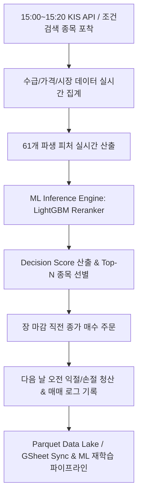

# 📈 K-Closing Alpha (국내주식 종가매매 퀀트 시스템)

> **국내 주식 시장의 종가 매매(Closing Alpha) 전략을 위한 ML 기반 머신러닝 / 자동화 퀀트 파이프라인**

`K-Closing Alpha`는 한국 주식 시장(KOSPI / KOSDAQ)의 장 마감 직전(15:00~15:20) 조건검색 종목들을 수집하고, 머신러닝(ML) 랭킹 및 분류 모델을 통해 다음 날 오전에 청산하는 **단기 종가매매 전략**을 실행하는 퀀트 파이프라인 프로젝트입니다.

---

## 📑 목차
1. [프로젝트 개요](#1-프로젝트-개요)
2. [전체 시스템 흐름 (Workflow)](#2-전체-시스템-흐름-workflow)
3. [데이터 파이프라인 및 데이터셋](#3-데이터-파이프라인-및-데이터셋)
4. [머신러닝(ML) 알고리즘 및 예측 모델](#4-머신러닝ml-알고리즘-및-예측-모델)
5. [백테스트 및 OOF 평가 결과](#5-백테스트-및-oof-평가-결과)
6. [디렉토리 구조 (Directory Structure)](#6-디렉토리-구조-directory-structure)
7. [빠른 시작 (Quick Start)](#7-빠른-시작-quick-start)

---

## 1. 프로젝트 개요

* **전략 유형**: 국내 주식 장 마감 직전 매수 후 다음 날 익절/손절 청산하는 **오버나이트 단기 종가매매(Closing Price Trading)**
* **투자 대상**: KOSPI / KOSDAQ 당일 강세 조건 검색 및 기술적/수급 조건 포착 종목
* **핵심 목표**: 
  - 수천 개 후보 종목 중 수익 가능성이 높은 상위 종목을 정밀 랭킹(`Decision Score`)하여 포트폴리오 선정
  - 수급(기관/외인/프로그램), 시장 지수 변동성(KOSPI, KOSDAQ, V-KOSPI), 개별 주가 기술적 지표를 결합한 61개 고차원 피처 분석
  - 한국투자증권(KIS) API와 Google Sheets 연동을 통한 실시간 매매 알고리즘 추론 및 데이터 동기화

---

## 2. 전체 시스템 흐름 (Workflow)



1. **데이터 수집 (`src/sync`, `src/api`)**:
   - 장중 및 마감 전 KIS API를 통해 실시간 OHLCV, 수급(기관/외인 순매수, 프로그램 매수), 시장 지수(V-KOSPI/V-KOSDAQ 등) 수집.
2. **피처 엔지니어링 (`src/processing`, `legacy/ml_research/features`)**:
   - 종목별 기술적 지표, 상대강도, 시나리오 조건(상따, 120일선 돌파, 거래량 폭발 등) 61개 수치 피처 생성.
3. **ML 추론 및 랭킹 (`src/serving/realtime`)**:
   - 사전 학습된 LightGBM Reranker 모델이 당일 후보 종목의 `Decision Score`를 실시간으로 계산하여 상위 종목 선택 (`ml-single-stock-v1` 정책).
4. **실전 매매 및 기록 (`src/daily`)**:
   - 종가 매수 진행 후 익일 장초 청산. 모든 거래 이력 및 일별 피처는 Parquet 기반 Data Lake에 저장 및 GSheet에 동기화.

---

## 3. 데이터 파이프라인 및 데이터셋

| 데이터 분류 | 저장 경로 / 데이터셋 | 주요 정보 |
|---|---|---|
| **매매 로그 (Trade Log)** | `data/parquet/trade_log.parquet` | 2016-01-04 ~ 2026-08-03 (33,934행, 2,488개 종목) |
| **가격 이력 (Price History)** | `data/history/price_history.parquet` | 전 종목 일별 OHLCV, 시가총액, 거래대금 |
| **테마 데이터 (Theme Info)** | `data/parquet/theme.parquet` | 당일 주도 테마 및 주도주 조인 피처 |

### 주요 피처 셋 (`close_morning61`)
총 **61개 수치형 피처**를 사용하며, 크게 4가지 영역으로 구성됩니다:
1. **가격 & 거래량 지표**: `change_rate`, `turnover`, `body_ratio`, `upper_shadow_ratio`, `intraday_range`, `gap_ratio` 등
2. **수급 지표**: `inst_net_buy`, `foreign_net_buy`, `prog_net_buy`, `inst_density`, `foreign_density`, `major_density`, `prog_dominance` 등
3. **시장 & 지수 지표**: `kospi_change`, `kosdaq_change`, `v_kospi`, `v_kosdaq`, `sector_relative_change` 등
4. **시나리오 패턴 지표**: `scenario_is_sangtta`, `scenario_is_120_breakout`, `scenario_is_volume_surge`, `scenario_is_new_high` 등

---

## 4. 머신러닝(ML) 알고리즘 및 예측 모델

* **주요 알고리즘**: **LightGBM (Gradient Boosting Decision Tree)** 기반 Reranker 및 Quantile Regressor
* **교차 검증 (Cross-Validation)**: **Purged Time-Series Group K-Fold (`n_splits=5`, `purge_gap=1`)**
  - 타임시리즈 정합성을 유지하고, 거래 간 중첩으로 인한 오버피팅/시합 편향을 방지하기 위한 Purged OOF 적용
* **라벨ing 및 손실 함수**:
  - 왕복 거래비용(수수료+슬리피지 0.20%) 차감 후 순수익률(`decimal_net`) 기준
  - `target_good` (+1% 이상) / `target_bad` (-2% 이하) 임계값 기반의 복합 랭킹 알고리즘

### 4.1. 스코어(Score) 및 매매 결정(Decision) 산출 로직

1. **`Decision Score` 계산**:
   - `decision_score = rank_weight * Rank_Score + p_good_weight * P_Good_Score` (기본 설정: `rank_weight=1.0`, `p_good_weight=0.5`)
2. **`Decision` 결정 및 정책 사유 (`SingleStockPolicy`)**:
   - **`BUY` (매수)**: `always_buy_top1` 정책에 의해 당일 Score 1위 종목을 매수 결정. (`reason: top1_buy`)
   - **`ABSTAIN` (관망)**: `margin_quantile` 정책 적용 시 top1 마진이 임계값 미달이거나, 유효한 정책 미발행 또는 당일 유니버스 미달 시 매수 보류. (`reason: below_margin_threshold`, `missing_validated_policy` 등)

### 4.2. 포지션 비중 조절 로직 (Position Sizing)

선정된 매수 종목에 대하여 자본 위험을 관리하기 위해 **동적 비중 조절(Dynamic Risk-Adjusted Position Sizing)**을 수행합니다:

$$\text{Position}_i = \text{BaseBudget} \times \text{GradeMultiplier}_i \times \left(\frac{\text{TargetVol}}{\sigma_i}\right) \times \text{UtilityScaling}_i$$

* **유틸리티 스코어 (`utility_score`)**: 순 기대수익(`q50`) 및 하방 리스크/불확실성 반영
* **하이브리드 등급 (`GradeMultiplier`)**:
  - 🟢 <span style="color:#2e7d32; font-weight:bold;">Strong</span> (`Multiplier: 1.0`): 상위 10% 이내 & $Utility \ge 0.0030$ & $q50 > 0$
  - 🟡 <span style="color:#f57f17; font-weight:bold;">Good</span> (`Multiplier: 0.75`): 상위 25% 이내 & $Utility \ge 0.0010$ & $q50 > 0$
  - 🟠 <span style="color:#e65100; font-weight:bold;">Weak</span> (`Multiplier: 0.5`): 상위 50% 이내 & $Utility \ge 0.0010$ & $q50 > 0$
  - 🔴 <span style="color:#c62828; font-weight:bold;">Pass</span> (`Multiplier: 0.0`): 미달 종목 또는 관망 (`ABSTAIN`)
* **위험 한도 (Risk Limits)**: 개별 종목 최대 비중 25% 제한 (`max_position_pct=0.25`), 전체 종목 총 비중 100% 한도 적용. 불리한 시장 국면(평균 Utility < 0) 시 전체 한도 자동 축소.

### 4.3. 터미널 추론 & 매매 결정 출력 예시 (Colorized Example)

추론 파이프라인(`src.daily.predict`) 실행 시 터미널 및 로그에 출력되는 터미널 ANSI 색상 적용 예시입니다:

```text
=== Daily Closing Alpha Prediction ===
-----------------------------------------------------------------------------------------
|  Rank  |    Stock Name    |   Rate   |      Scenario      |   Score  |   Decision   |
-----------------------------------------------------------------------------------------
|   1    | 삼성전자         |  +2.35%  | volume_surge       |  0.8421  |   [ BUY ]    |  (Reason: top1_buy | Grade: Strong)
-----------------------------------------------------------------------------------------
|   2    | SK하이닉스       |  +1.12%  | new_high           |  0.7105  |  [ABSTAIN]   |  (Reason: top1_only_policy | Grade: Pass)
|   3    | 현대차           |  -0.45%  | 120_breakout       |  0.5420  |  [ABSTAIN]   |  (Reason: below_threshold | Grade: Pass)
-----------------------------------------------------------------------------------------
> Decision: BUY | Reason: top1_buy | Stock: 005930 | Score: 0.8421 | Allocated Weight: 25.00%
```

| Decision 색상 구분 | 상태 | 설명 | 대표 사유 (Reason) |
|---|---|---|---|
| 🟢 **`BUY`** | 매수 | 매수 실행 대상 종목 | `top1_buy`, `top1_buy_margin` |
| 🔴 **`ABSTAIN`** | 관망 | 매수 보류 / 관망 대상 종목 | `below_margin_threshold`, `no_executable_candidate`, `missing_validated_policy` |


---

## 5. 백테스트 및 OOF 평가 결과

`legacy/ml_research/training/retrain_bundle.py`를 통해 2016년~2026년 10개년 데이터(33,934건) 기반으로 평가된 OOF(Out-of-Fold) 정책 수행 결과입니다.

| 평가 지표 (OOF Policy Metrics) | 성과 측정 값 |
|---|---:|
| **총 스케줄 일수** | 2,155 일 |
| **매수 실행 결정 비율 (Active Trade Rate)** | **88.31%** (1,903회 매수 / 252회 관망) |
| **스케줄 기준 평균 수익률 (Daily Return)** | **1.1934%** |
| **스케줄 기준 승률 (Daily Win Rate)** | **54.15%** |
| **활성 거래 평균 수익률 (Active Trade Return)** | **1.3514%** |
| **활성 거래 승률 (Active Trade Win Rate)** | **61.32%** |
| **Profit Factor** | **2.2981** |
| **스케줄 기준 Sharpe Ratio** | **4.7608** |

*(※ 위 성과 지표는 거래비용 0.20%가 반영된 순수익 기준 OOF 검증 결과입니다.)*

---

## 6. 디렉토리 구조 (Directory Structure)

```text
k-closing-alpha/
├── src/                      # 실전 운영 파이프라인 패키지
│   ├── api/                  # 한국투자증권(KIS) API 클라이언트 & Rate Limiter
│   ├── config/               # Pydantic 기반 환경설정 (KIS, Trading, GSheet)
│   ├── daily/                # 일별 데이터 수집, 예측, 아카이브 스케줄러
│   ├── data/                 # Parquet / Google Sheets 데이터 로더
│   ├── processing/           # 스케일 보정 및 데이터 전처리 스키마
│   ├── serving/realtime/     # 실시간 ML 추론 엔진 & 매매 정책 파이프라인
│   └── sync/                 # 수급(기관/외인/프로그램) & 시장 지수 동기화
├── legacy/ml_research/       # ML 모델 연구, 피처 생성, Purged CV 및 백테스팅
├── data/                     # Data Lake (Parquet 및 수집 데이터 저장소)
├── artifacts/models/         # 학습된 Sizing & Reranker ML 모델 번들 (.joblib)
├── docs/                     # 시스템 문서, 코드 맵, 연구 결과 리포트
├── tests/                    # Unit / Integration 테스트 모듈 (Pytest)
├── pyproject.toml            # 프로젝트 의존성 및 Ruff / Mypy / Pytest 설정
└── README.md                 # 프로젝트 통합 설명서
```

---

## 7. 빠른 시작 (Quick Start)

### 1) 환경 설정 (`uv` 패키지 매니저 사용)
본 프로젝트는 Python 3.11+ 환경 및 `uv` 매니저를 기반으로 작동합니다.

```bash
# 의존성 설치
uv sync
```

### 2) 테스트 코드 실행
```bash
# 전체 unit / integration 테스트 수행
uv run pytest

# 코드 스타일 및 타입 검사
uv run ruff check .
uv run mypy .
```

### 3) 일별 추론 파이프라인 실행
```bash
# 장 마감 직전 추론 수행 (Top 종목 추출)
uv run python -m src.daily.predict

# 저녁 1회 실행(20:00 이후 권장): 당일 워치리스트 정규세션+NXT 애프터마켓 1분봉 아카이브
# src.daily.archive_intraday
uv run python -m src.daily.archive_intraday

# 1회성 소급 백필: condition_history 워치리스트 대상 일별분봉(FHKST03010230) 백필
# src.backfill.intraday.backfill_minute_history
uv run python -m src.backfill.intraday.backfill_minute_history
```

### 4) ML 연구 및 번들 재학습
```bash
# Purged CV 기반 번들 학습 및 평가
uv run python -c "from legacy.ml_research.training.retrain_bundle import train_and_save_real_model_bundle; train_and_save_real_model_bundle()"
```

---
*Created & Maintained by K-Closing Alpha Team*
