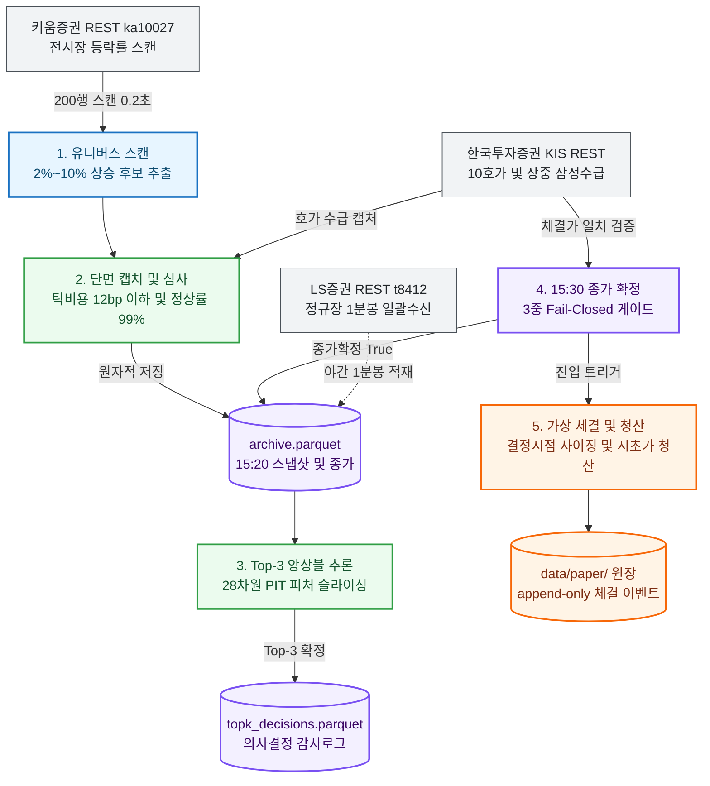

# K-Closing Alpha

> **국내 주식(KOSPI/KOSDAQ) 종가단일가(15:20~15:30) 실시간 수집 및 익일 시초가(09:00) 기계적 청산 Top-3 머신러닝 퀀트 시스템**


---

## 1. System Highlights

| 핵심 엔지니어링 지표 | 실측 성과 / 보장 기준 | 아키텍처 불변식 및 강제 장치 |
| :--- | :---: | :--- |
| 📈 **도메인 성과 (Net Return)** | **`+34.58 bp / 일`** (Sharpe **`2.73`**) | 법정거래세(18~23bp) + 왕복 2.0틱 스프레드 + 우대수수료(왕복 0.73bp) 전액 실측 차감 후 순알파 |
| 🛡️ **정보 누출 방지 (Look-Ahead)** | **`0.00%`** (완전 차단) | 15:20 PIT 의사결정 시점과 15:30 종가 확정 시점 원장 분리 (`decision_close` vs `close`) |
| ⚡ **실시간 처리 속도 (Latency)** | **`0.2초`** 스캔 / **`1.1초`** 추론 | 키움 REST 200행 고속 스캔 및 Polars 기반 제로카피 28차원 피처 슬라이싱 |
| 🚀 **운영 연속성 (Feasibility)** | **`99.89%`** (884일 진입 / 1일 관망) | 4대 증권사 OpenAPI 쿼터 분산(TPS 18 병목 해소) 및 KIS 토큰 슬롯 격리 자동 갱신 |
| ⏱️ **시계열 정합성 (Integrity)** | **오차 허용 `0건`** | 3중 Fail-Closed 게이트 (KST 15:30:00 도달 + 마감코드 '3' + 현재가/호가 체결가 일치 검증) |
| 🔒 **원장 동시성 및 보존 (Safety)** | **경쟁 결함 `0건`** | 커널 `flock` 기반 세션 락 직렬화, Append-only 체결 이벤트 로깅, tar.zst 세그먼트 백업 |

---

## 2. Tech Stack

| 분류 | 기술 | 채택 근거 및 트레이드오프 |
| :--- | :--- | :--- |
| **Language & Tooling** | `Python 3.11+`, `uv` | 빠른 의존성 동기화와 엄격한 타입 힌팅 (`mypy`, `ruff`). 인터프리터 오버헤드는 벡터화 연산으로 극복 |
| **Data Engine & Storage** | `Polars`, `Parquet`, `zstd` | 10년치 패널 제로카피 로딩. 단일 행 수정 불가 트레이드오프는 `atomic_write_parquet` 원자적 교체로 해결 |
| **Concurrency & Network** | `asyncio`, `websockets` | 15:20 시점 4사 API 비동기 I/O 및 실시간 체결틱(`H0STCNT0`) 무차단 펌프 처리 |
| **Quant & ML Engine** | `LightGBM`, `CPCV(8,2)` | 5-Seed 앙상블 및 168시간 시계열 엠바고(정보 누출 방지 유예) 적용 횡단면 상대 랭킹 학습 |
| **Execution & Broker** | `Kiwoom`, `KIS`, `LS`, `Toss` | 단일사 Rate Limit 우회: 키움(스캔), KIS(호가/수급), LS(1분봉), 토스(쿼트 백업) 분산 라우팅 |
| **Infra & Automation** | `Linux systemd`, `flock` | 단일 호스트 경량 24/7 상태머신 구동, 프로세스 경합 방지 및 Google Drive 세그먼트 백업 |

---

## 3. Daily Workflow & Pipeline

| 시각 (KST) | 단계 | 핵심 처리 내용 |
| :---: | :--- | :--- |
| 🌅 **15:20:00** | **1. 후보 스캔 & 적격 심사** | 키움 200행 스캔 $\to$ 저가치주 13.8% 배제 $\to$ 12.0bp 틱비용 상한 필터 적용 |
| ⚡ **15:20:10** | **2. 단면 캡처 & 앙상블 추론** | KIS 10호가/잠정수급 수집(정상률 $\ge$ 99% 게이트) $\to$ 28차원 PIT 피처 산출 $\to$ Top-3 선정 |
| 🌙 **15:30:30** | **3. 3중 종가 확정 & 가상 진입** | 시계 + 단일가코드('3') + 체결가 일치 3중 검증 $\to$ 결정시점 사이징 기반 가상 매수 원장 기록 |
| 🛡️ **익일 09:00** | **4. 기계적 청산 & 무결성 감사** | 사후 갭 필터 없이 익일 시초가 전량 청산 $\to$ 세션 캘린더 증명 $\to$ 일일 원장/백업 감사 |



---

## 4. Top 5 Real-world Engineering Invariants (핵심 챌린지)

### 1. Point-in-Time 정보 누출 방지와 듀얼 타임스탬프 격리
* 🚨 **문제**: 15:30 확정 종가나 익일 시초가 갭을 미리 참조하는 사후 정보 편향(Look-Ahead Bias) 발생 시 백테스트와 실전 간 치명적 괴리 발생.
* 📐 **원칙**: 의사결정 시점(15:20)에 관측 불가능한 미래 데이터 유입은 0건이어야 하며, 사후 갭 필터 등 백테스트 환각을 전면 배제한다.
* 💡 **해결**: `decision_close`(15:20 잠정가)와 `close`(15:30 확정가)를 분리 보존하고, 익일 09:00 시초가 기계적 전량 청산으로 장중 리스크 노출 시간을 **`0분`**으로 단축.

### 2. 저가주 호가단위 마찰비용 잠식 차단 (Tick Friction)
* 🚨 **문제**: 5,000원 미만 저가주는 1틱이 20~50bp에 달해, 왕복 스프레드와 거래세 차감 시 모델의 예측 알파가 전액 잠식되어 실전 손실 발생.
* 📐 **원칙**: 1호가 간격이 기대 수익률을 초과하는 불리한 종목은 모델 추론 전 유니버스 스크리닝 단계에서 원천 차단한다.
* 💡 **해결**: 주가 구간별 1틱 비용 12.0bp 초과 종목 및 상한가 근접 종목(`chg_ratio >= 0.29`)을 원천 배제하여 연환산 Sharpe **`+0.84`** 향상 실증.

### 3. 단일 증권사 API 한도와 10분 결정창 병목 해소
* 🚨 **문제**: 15:20~15:30의 10분 창 내에 전종목 스캔, 10호가/수급 조회, 분봉 아카이빙을 단일 벤더(TPS 18)로 수행 시 429 차단 발생.
* 📐 **원칙**: 특정 브로커 장애가 전체 파이프라인 정지로 이어지지 않도록 브로커 특성별 분산 라우팅과 무차단 비동기 I/O를 강제한다.
* 💡 **해결**: 키움(200행 스캔 0.2초) + KIS(10호가/수급 캡처) + LS(390개 1분봉 일괄 수신) + 토스(멀티 쿼트 백업) 결합으로 수집 시간을 **`6초`** 이내로 단축.

### 4. 금융 시계열 자기상관성 과적합 방어 (Purged CV)
* 🚨 **문제**: 전통적 K-Fold 교차검증 적용 시 시계열 인접 구간의 정보 누출과 시장 일별 노이즈 학습으로 라이브 환경에서 성능 급락.
* 📐 **원칙**: 시간 순서가 보존된 무누출 블록 분할과 횡단면 상대 랭킹 학습을 통해서만 일반화 성능을 검증한다.
* 💡 **해결**: Combinatorial Purged CV(8,2)로 28개 무누출 경로를 평가하고, **`168시간 시계열 엠바고(정보 누출 방지 유예)`** 및 `date_demeaned` 타깃 5-Seed LGBM 앙상블 적용.

### 5. 휴장일 유령 체결 방지와 원장 동시성 무결성 (Ledger Integrity)
* 🚨 **문제**: 스케줄러 재시작 시 임의 시각 체결이나 휴장일 전일 종가 기반 가상 체결이 발생하여 기준 포트폴리오(단위북 1.0x) 자산 가치 왜곡.
* 📐 **원칙**: 모든 체결은 당일 세션 증명(Session Attestation)을 거쳐야 하며, 원장 수정은 감사 가능한 단방향(Append-only) 이벤트로만 허용한다.
* 💡 **해결**: 세션 캘린더 단일 리졸버와 일봉 영업일 이중 검증을 도입하고, 커널 `flock` 기반 호스트 세션 락으로 프로세스 경합 결함 **`0건`** 보장.

---

## 5. Verified Performance Matrix (실측 정본 성과)

> **출처**: `docs/research/closing_strategy_matrix.md` 및 `artifacts/research/costaware_topk_report.parquet`  
> **검증 기간**: 2023-01-25(KRX 호가단위 개편일) ~ 2026-09-10 (886 거래일, 68,493개 단면)  
> **비용 조건**: KRX 법정거래세(18~23bp) + 보수적 왕복 2.0틱 호가 스프레드 + KIS 우대수수료(왕복 0.73bp) 전액 실측 차감

| 파이프라인 모델 | 전략 조건 및 사이징 | 일평균 순수익 | Sharpe | t-statistic | 일별 승률 | 최대 낙폭 (MDD) |
| :--- | :--- | :---: | :---: | :---: | :---: | :---: |
| **비용 비인식 기준선** | Base Top-3 (Equal-Weight) | +31.27 bp | 2.57 | 4.81 | 55.8% | 25.03% |
| **동적 K형 알파 챔피언** | Dynamic K (확신도 스프레드 $\ge$ 15bp 시 K=1, 외 K=3) | **+36.47 bp** | **2.59** | **4.86** | **55.0%** | **21.28%** |
| **역틱 가중 개선 모델** | Current Cap (12bp) + 역틱 가중치 (Inv-Tick) | **+34.58 bp** | **2.73** | **5.12** | **56.3%** | **28.98%** |
| **극방어형 쉴드 챔피언** | K=2~3 + 당일 시가 갭유지 + 외인·기관 쌍끌이 순매수 | **+27.54 bp** | **2.85** | **5.34** | **48.9%** | **11.86%** |

---

## 6. Architecture Layer Contracts

```text
Layer 4: Production CLI & System Entrypoints (src/daily/, src/backfill/, src/tools/)
   ↓
Layer 3: Serving & Automation Orchestrators (src/serving/, src/ml/retrain.py)
   ↓
Layer 2: Quant Domain Engine & Research (src/strategy/, src/ml/, src/execution/)
   ↓
Layer 1: Data Access & Infrastructure Gateways (src/data/, src/api/, src/sync/, src/utils/)
   ↓
Layer 0: Core Schemas, Types, and Configurations (src/config/, src/settings.py)
```

---

## 7. Quick Start & Verification

```bash
# 1. 가상환경 동기화
uv sync

# 2. 전체 단위 및 통합 테스트 스위트 검증 (1,061개 Invariant Guards)
uv run pytest

# 3. 실시간 일별 파이프라인 단계별 수동 검증
uv run python -m src.daily.collect         # 15:20 후보 스캔 및 단면 수집
uv run python -m src.daily.predict         # 15:21 Top-3 리랭커 추론
uv run python -m src.daily.finalize_close  # 15:30 3중 종가 확정
uv run python -m src.daily.paper_trade --phase entry # 15:30 가상 매수
uv run python -m src.daily.paper_trade --phase exit  # 익일 09:00 기계적 청산

# 4. 아키텍처 정본 문서
# • 시스템 상세 설계서: docs/architecture/system-design.md
# • 핵심 기술 의사결정(ADR): docs/architecture/engineering-decisions.md
```
