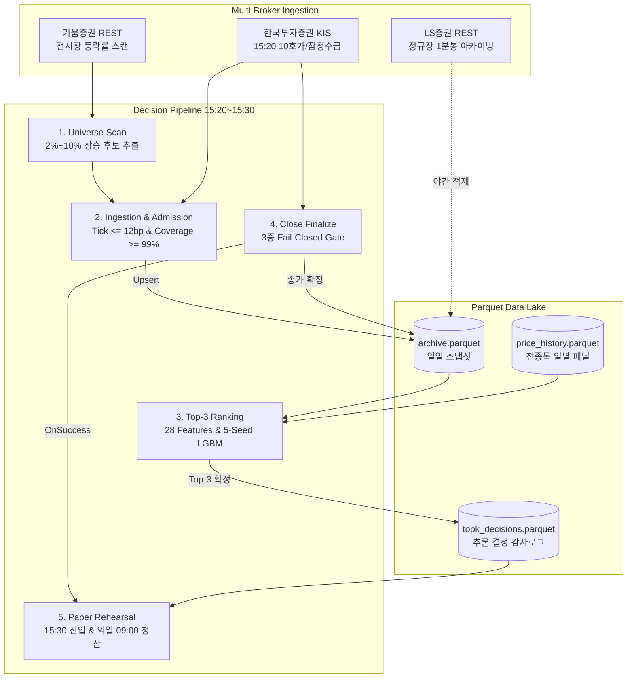

# K-Closing Alpha

> **국내 주식(KOSPI/KOSDAQ) 종가단일가(15:20~15:30) 실시간 수집 및 익일 시초가(09:00) 청산 Top-3 머신러닝 퀀트 시스템**

---

## 1. Project Overview

`k-closing-alpha`는 장 마감 직전 10분의 제한된 시간 창(15:20~15:30) 내에서 당일 강세 후보 종목을 수집·가공하고, 비용 인식형(Cost-Aware) 머신러닝 리랭커를 통해 **당일 종가 매수 후 익일 시초가에 기계적 전량 청산하는 오버나잇 퀀트 트레이딩 파이프라인**입니다.

* **핵심 문제**: 금융 시계열의 미래 정보 누출(Look-Ahead Bias)과 저가주 호가단위 스프레드(Tick Friction)로 인한 실전 수익성 붕괴 방어.
* **주요 기능**: 전시장 등락률 스캔 $\rightarrow$ 15:20 호가/수급 캡처 $\rightarrow$ 28차원 PIT 피처 생성 $\rightarrow$ 5-Seed LightGBM 앙상블 추론 $\rightarrow$ 15:30 종가 확정 게이트 $\rightarrow$ 익일 청산 리허설 자동화.
* **핵심 기술**: 4개 증권사 API 분산 라우팅, Combinatorial Purged CV(8,2), Fail-Closed 데이터 무결성 게이트, Parquet 데이터 레이크.

---

## 2. Why This Project / Problem

1. **Point-in-Time (PIT) 시점 정보 누출 (Look-Ahead Bias)**:
   - 많은 전략이 15:30에 결정되는 최종 종가나 익일 시초가 갭을 사전에 알고 매수하는 환각 편향을 가집니다.
   - 본 시스템은 15:20 시점에 관측 가능한 데이터만을 엄격히 분리하여 의사결정을 내립니다.
2. **호가단위 마찰비용(Tick Cost Friction)에 의한 알파 잠식**:
   - 국내 5,000원 미만 저가주는 1틱(호가 1칸)이 주가의 20~50bp에 달합니다.
   - 왕복 2틱(40~100bp) 스프레드 크로싱과 법정 증권거래세(18~23bp)를 차감하면 명목 수익률이 높아도 실질 순손실로 전락합니다.
3. **단일 증권사 API의 초당 요청 한도(Rate Limit) 병목**:
   - 15:20~15:30의 10분 내에 전종목을 스캔하고 10단계 호가 및 수급을 조회해야 하므로, 단일 증권사(TPS 18건)로는 수집 지연 및 차단(HTTP 429)이 발생합니다.

---

## 3. Key Features

* **비용 인식형 유니버스 스크리닝 (`COST_AWARE_UNIVERSE`)**
  - *구현:* 주가 구간별 1틱 비용이 12.0bp를 초과하는 종목 및 상한가 근접 종목(`chg_ratio >= 0.29`)을 추론 전 원천 배제.
  - *효과:* 호가 스프레드에 의한 실전 수익성 훼손을 사전 차단하고 백테스트-실전 간 괴리 최소화.
* **4개 증권사 OpenAPI 특화 분산 라우팅**
  - *구현:* 키움(200행 고속 전시장 스캔) $\rightarrow$ KIS(15:20 10호가/잠정수급 캡처) $\rightarrow$ LS(단일 호출 500개 1분봉 아카이빙) $\rightarrow$ 토스(멀티 쿼트 폴백).
  - *효과:* 15:20 의사결정 수집 시간을 6초 이내로 단축하여 API Rate Limit 병목 해결.
* **3중 Fail-Closed 종가 확정 게이트**
  - *구현:* 15:30:30 시계 체크 + 단일가 마감 코드('3') + 현재가/호가 체결가 일치 검증.
  - *효과:* 불완전 체결 시점의 데이터 오염을 방지하고 `decision_close`(15:20)와 `close`(15:30)를 분리 관리.
* **Combinatorial Purged Cross-Validation (CPCV 8,2) & 5-Seed 앙상블**
  - *구현:* 8개 시계열 블록 중 2개 테스트 블록 조합으로 28개 무누출 OOF 경로를 평가하고, 5개 시드 LightGBM 앙상블 적용.
  - *효과:* 시계열 자기상관성으로 인한 과적합을 차단하고 횡단면 상대 랭킹 안정성 확보.
* **실시간 체결틱 기반 페이퍼 트레이딩 리허설**
  - *구현:* 실주문 전송 없이 실시간 체결틱(WebSocket `H0STCNT0`)을 구독하여 시장가/목표가 가상 체결 및 원장 기록.
  - *효과:* 무위험 환경에서 실시간 슬리피지 및 체결 엔진 안정성 리허설.

---

## 4. Architecture



---

## 5. End-to-End Flow

| 단계 | 시각 (KST) | 처리 내용 | 주요 모듈 |
| :--- | :---: | :--- | :--- |
| **1. 후보 스캔** | `15:20:00` | 키움 REST API로 당일 2%~10% 등락률 전시장 종목 스캔 (0.2초) | `src/daily/universe_scan.py` |
| **2. 단면 캡처** | `15:20:10` | KIS 현재가·10호가·잠정수급 수집, 12bp 틱비용 필터, 정상률 99% 검증 | `src/daily/collect.py` |
| **3. 랭킹 추론** | `15:21:00` | 28차원 PIT 피처 산출 및 5-Seed LightGBM 앙상블로 Top-3 등가중 선정 | `src/daily/predict.py` |
| **4. 종가 확정** | `15:30:30` | 15:30 장마감 단일가 3중 게이트 검증 후 아카이브 인플레이스 갱신 | `src/daily/finalize_close.py` |
| **5. 가상 진입** | `15:30:35` | 종가 확정 즉시 트리거되어 자본 비중 할당 및 가상 체결 기록 | `src/daily/paper_trade.py` |
| **6. 기계적 청산** | 익일 `09:00:00` | 사후 갭 필터 없이 익일 시초가에 전량 기계적 청산 및 손익 반영 | `src/daily/paper_trade.py` |

---

## 6. Repository Structure

```text
k-closing-alpha/
├── src/
│   ├── daily/                # 일별 자동화 파이프라인 (스캔, 수집, 추론, 종가확정, 페이퍼매매)
│   ├── ml/                   # 머신러닝 리서치 (CPCV 8,2, 리랭커, 피처엔지니어링, 재학습 CLI)
│   ├── serving/realtime/     # 실시간 서빙 피처 변환 및 모델 번들 로더
│   ├── strategy/             # 유니버스 스크린 및 전략 불변 계약 (COST_AWARE_UNIVERSE)
│   ├── execution/            # 실측 법정세율 스케줄, 호가단위 틱비용 모델, 페이퍼 브로커
│   ├── data/                 # Parquet 코덱, 패널 정합성 복구, 일중 분봉/호가 스토어
│   ├── api/                  # 증권사 4사(KIS, Kiwoom, Toss, LS) OpenAPI 클라이언트
│   └── tools/                # 시스템 감사(daily_audit), 웹훅 실패 알림(alerts)
├── artifacts/models/         # 학습된 5-Seed ML 모델 번들 및 CPCV 검증 리포트
├── data/history/             # Parquet 데이터 레이크 (수정주가, 일일 스냅샷, 분봉/틱)
├── deploy/systemd/           # 무중단 스케줄링 systemd 서비스 및 타이머 유닛
├── docs/architecture/        # 아키텍처 개요, 데이터 흐름, 컴포넌트, ADR 문서
│   └── data/                 # 증권사 OpenAPI 상세 규격서 모음
└── tests/                    # 1,061개 단위/통합 테스트 스위트 (100% Pass)
```

---

## 7. Technical Decisions

| 결정 사항 | 선택 이유 (Why) | 트레이드오프 (Trade-off) |
| :--- | :--- | :--- |
| **Parquet 컬럼형 스토리지** | 10년 치 전종목 패널에서 15:20 시점 28개 롤링 피처를 1초 내 계산하기 위한 제로카피 I/O | 단일 행 실시간 업데이트 불가 $\rightarrow$ 임시 파일 원자적 교체(`atomic_write_parquet`)로 해결 |
| **증권사 4사 분산 라우팅** | 단일 증권사의 초당 요청 한도(TPS 18)와 15:20 결정창(10분) 병목 해소 | 증권사별 상이한 인증 규약 및 응답 데이터 정규화 레이어 유지보수 비용 |
| **12.0bp 틱비용 상한 필터** | 1호가당 20~50bp를 지불해야 하는 저가 동전주 알파 잠식 차단 | 변동성이 큰 저가 테마주 일부 탈락 (단, 포트폴리오 MDD와 실현가능성 대폭 개선) |
| **CPCV(8,2) & 5-Seed 앙상블** | 시계열 자기상관성 과적합을 방지하고 당일 후보군 내 상대적 랭킹 우위 극대화 | 5개 모델 유지로 추론 시간 소폭 증가 (0.2초 $\rightarrow$ 1.1초, 허용 한도 내) |

---

## 8. Validation & Reliability

* **엄격한 시간 분할**: 
  - 학습/검증: 2016-01-04 ~ 2026-09-09
  - 인증(Certification): 2023-01-25(KRX 호가단위 개편일) ~ 2026-09-09 (885 거래일)
* **Point-in-Time 원칙**: 15:20 의사결정 시점에는 [t-w, t-1] 롤링 창 및 당일 15:20 잠정 수급만 사용하며 미래 데이터 참조 0건.
* **실측 마찰비용 차단**: 법정 증권거래세(18~23bp) + 보수적 왕복 2.0틱 스프레드 + 위탁수수료 전액 차감.
* **Fail-Closed 안전장치**: 장 시간 외/휴장일 실행 차단, 단면 수집 정상률 99% 미달 시 저장 거부, 3중 종가 확정 게이트.
* **테스트 신뢰성**: 1,061개 Unit/Integration 테스트 100% 통과 (`uv run pytest`).

---

## 9. Empirical Results

KRX 호가단위 개편 이후 인증 구간(2023-01-25 ~ 2026-09-09, 885 거래일) 실측 성과:

### 1) 프로덕션 Top-3 랭커 성과 (비용 전액 차감 후 순수익 기준)

| 평가 지표 (Metric) | 실측 측정값 (Measured Value) |
| :--- | :---: |
| **검증 기간 (Trading Days)** | **885 일** |
| **전략 실행 가능일 비율 (Feasibility)** | **99.89%** (884일 진입 / 1일 관망) |
| **일평균 순수익률 (Mean Net Return)** | **+46.08 bp / 일** (중앙값: **+36.94 bp**) |
| **일별 승률 (Daily Win Rate)** | **58.98%** (522승 362패) |
| **연환산 샤프 지수 (Sharpe Ratio)** | **3.48** (t-statistic: **6.53**) |
| **비용정렬 기준선 대비 우위 (vs Cost-Sort)** | **28 / 28 경로 승리 (100%)**, 평균 초과 알파 **+25.39 bp** ($p=0.000214$) |

### 2) 연도별 안정성 및 비용 스트레스 테스트

| 연도 | 거래일수 | 일평균 순수익 | Sharpe | | 스프레드 시나리오 | 일평균 순수익 | t-stat | 결과 |
| :---: | :---: | :---: | :---: |---| :--- | :---: | :---: | :---: |
| **2023** | 230 일 | +34.33 bp | 3.12 | | **기준선 (왕복 2.0틱)** | **+46.08 bp** | **6.53** | **PASS** |
| **2024** | 244 일 | +28.57 bp | 2.51 | | **1.5배 마찰 (왕복 3.0틱)** | **+38.03 bp** | **5.38** | **PASS** |
| **2025** | 242 일 | +65.71 bp | 5.30 | | **2.0배 극단 (왕복 4.0틱)** | **+29.98 bp** | **4.24** | **PASS** |
| **2026** | 169 일 | +59.24 bp | 3.20 | | *(극심한 유동성 경색 시에도 통계적으로 유의한 순알파 유지)* | | | |

---

## 10. Getting Started

```bash
# 1. 의존성 설치
uv sync

# 2. 전체 1,061개 테스트 수행
uv run pytest

# 3. 실시간 파이프라인 수동 실행
uv run python -m src.daily.collect         # 15:20 단면 수집
uv run python -m src.daily.predict         # 15:21 Top-3 랭커 추론
uv run python -m src.daily.finalize_close  # 15:30 종가 확정
uv run python -m src.daily.paper_trade --phase entry # 15:30 페이퍼 진입
uv run python -m src.daily.paper_trade --phase exit  # 익일 09:00 페이퍼 청산

# 4. systemd 타이머 자동화 설치 (Linux/WSL)
bash deploy/install_systemd.sh
```

---

## 11. Documentation

* [System Architecture Overview](file:///home/kth/k-closing-alpha/docs/architecture/overview.md) — 시스템 경계 및 브로커 쿼터 매트릭스
* [Data Flow & Invariants](file:///home/kth/k-closing-alpha/docs/architecture/data-flow.md) — 듀얼 타임스탬프 규약 및 5대 Fail-Closed 게이트
* [Component Architecture](file:///home/kth/k-closing-alpha/docs/architecture/components.md) — 모듈별 책임 및 I/O 계약
* [Architecture Decision Records (ADRs)](file:///home/kth/k-closing-alpha/docs/architecture/design-decisions.md) — 5대 기술적 의사결정 Rationale & Trade-offs
* [Broker OpenAPI Specifications](file:///home/kth/k-closing-alpha/docs/architecture/data/api_master.md) — 증권사 4사 API 세부 규격서

---

## 12. Limitations

1. **실주문 OMS 미연동 (Paper Rehearsal 한정)**: 현재 파이프라인은 가상 체결 원장 기반 리허설로 운영되며, 실계좌 자금 집행을 위해서는 추가 주문 승인 게이트 및 킬스위치가 필요합니다.
2. **익일 장중 동적 청산 미지원**: 오버나잇 갭에만 집중하므로 익일 09:00 이후 발생하는 장중 급등락에 대한 트레일링 스탑은 수행하지 않습니다.
3. **유동성 용량 한계 (Capacity Ceiling)**: Top-3 종목 집중 전략 특성상 운용 자산(AUM) 규모가 수십억 원 이상으로 커질 경우 시장 충격 비용이 증가할 수 있습니다.
