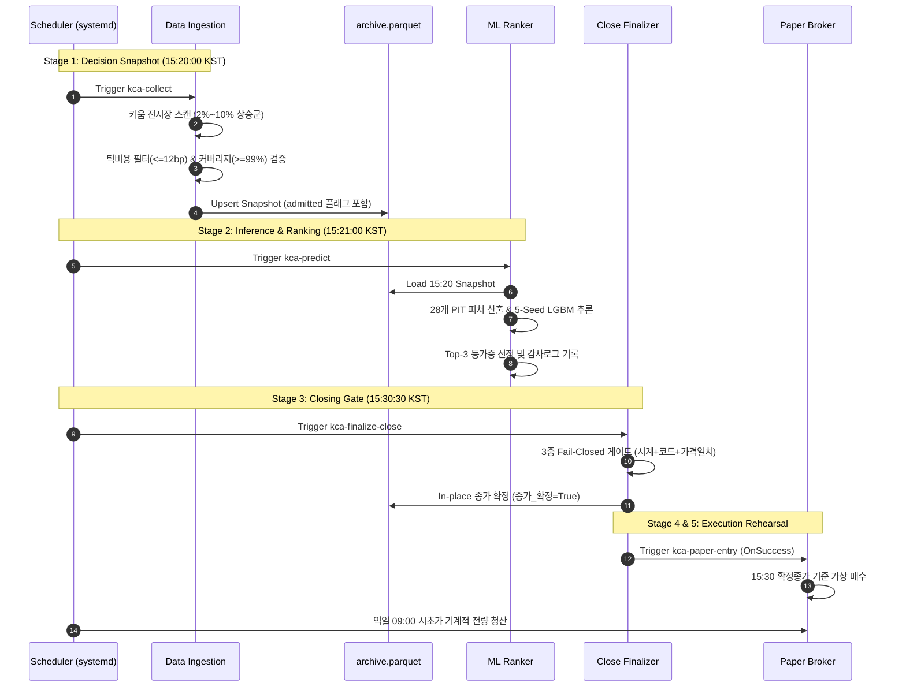

# Data Flow & Invariant Specification

> **Target Audience:** 데이터 엔지니어, 퀀트 리서처, 백엔드 아키텍트  
> **Key Principle:** Point-in-Time(PIT) 무결성을 강제하며, 15:20 시점에 관측 불가능한 미래 데이터 유입을 원천 차단한다.

---

## 1. End-to-End Pipeline Flow

---

## 2. Pipeline Execution Matrix

| 단계 | 시각 (KST) | 입력 데이터 | 처리 로직 | 출력 및 저장소 | 주요 안전장치 |
| :--- | :---: | :--- | :--- | :--- | :--- |
| **1. 후보 스캔** | `15:20:00` | 전종목 실시간 등락률 | 당일 2%~10% 상승 후보군 고속 추출 | 후보 리스트 (`list[dict]`) | 스캔 공백 시 즉시 종료 |
| **2. 단면 캡처** | `15:20:10` | KIS 현재가·10호가·수급 | 12bp 틱비용 필터, 이상치 검출, 단면 패널화 | `archive.parquet` `data/history/orderbook/` | • 15:20~15:30 외 실행 차단 • 정상률 < 99% 시 저장 거부 |
| **3. 피처/추론** | `15:21:00` | 당일 스냅샷 + 과거 패널 | 28개 PIT 피처 산출, 5-Seed 앙상블 추론 | `topk_decisions.parquet` | 결측 시 플레이스홀더 금지 (즉시 예외) |
| **4. 종가 확정** | `15:30:30` | KIS 장마감 체결/호가 | 시계, 마감코드('3'), 체결가 일치 3중 검증 | `archive.parquet` (EOD 인플레이스 갱신) | 불일치 시 `종가_확정=False` 유지 |
| **5. 가상 진입** | `15:30:35` | 확정 종가, 포트폴리오 | 자본 비중 할당, 정수 주문수량 체결 | `data/paper/orders.parquet` `data/paper/positions.parquet` | 종가 확정 성공 시에만 트리거 |
| **6. 기계적 청산** | 익일 `09:00` | 익일 시초가 시세/틱 | 사후 갭 필터 없이 시초가 전량 청산 | `data/paper/trades.parquet` | 실시간 체결틱 기반 슬리피지 반영 |

---

## 3. Data Invariants (Fail-Closed Gates)

### 3.1. 15:20 vs 15:30 듀얼 타임스탬프 스키마
* **`decision_close`**: 15:20 의사결정 당시의 장중 체결가 (영구 보존, 불변).
* **`종가`**: 15:30 장마감 단일가 매매로 확정된 공식 EOD 종가.
* **`종가_확정`**: 15:20에는 `False`, 15:30:30 확정 게이트 통과 시 `True`로 갱신.

### 3.2. 4대 Fail-Closed 런타임 가드
1. **시간창 게이트**: `15:20:00 <= now <= 15:30:00` KST 범위 밖 실행 시 즉시 중단 (`RuntimeError`).
2. **거래일 게이트**: KIS 캘린더 기준 휴장일 실행 차단 (`NonTradingDayError`).
3. **단면 정상률 게이트**: 호출 실패 또는 가격 모순(음수 가격, 시고저종 불일치 등) 비율이 1% 초과 시 전체 스냅샷 저장 거부.
4. **원자적 스토리지 갱신**: 모든 Parquet 쓰기는 임시 파일 기록 후 OS `rename`으로 원자적 교체 (`atomic_write_parquet`).
