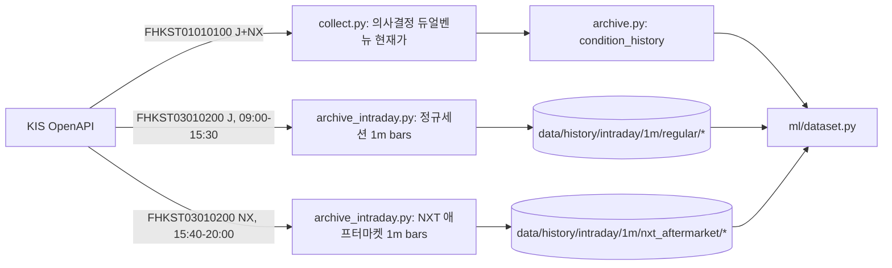

# Data Collection Architecture

## 1. System Boundary



Two independent entrypoints, run at different times of day (§5.1 explains why they cannot be
merged): `archive.py::main()` fires right after `collect.py`/`predict.py` (~15:18) and archives
the condition-search snapshot including the new dual-venue decision price; `archive_intraday.py`
is a **separate, standalone evening command** (documented in README, run once after 20:00) that
archives the full day's regular-session and NXT after-market minute bars for the same watchlist.

## 2. KRX / NXT Market Division (`FID_COND_MRKT_DIV_CODE`)

| Code | Meaning | Use in this project |
|---|---|---|
| `J` | KRX only | Official 종가/기준가 (T+1 reference price) labeling, and the primary full-day 1m bar series (§3–4) used for exit-timing backtests. |
| `NX` | NXT only | (a) NXT after-market 1m bars (15:40–20:00, §2.1, §6), and (b) the decision-time dual-venue capture below. Never blended into the primary close series. |
| `UN` | Unified (KRX+NXT merged) | **Avoided everywhere in this design.** `UN`'s exact live semantics (frozen-at-15:30 vs. continuing-with-NXT) were not empirically verified against a live session, and the actual execution venue is now known (below) — an explicit `J`+`NX` capture is strictly more informative than trusting an undocumented merge. |

**Two distinct prices, two distinct purposes — do not conflate them:**

1. **Official close (T+1 reference price):** always the KRX 15:30 closing-auction print,
   regardless of NXT activity (confirmed via KIS/broker NXT guides, independent of this
   codebase). `archive.py`'s "스냅샷 시각 미상 시 15:30 KST 관례" fallback models this correctly
   for rows that truly lack a captured timestamp.
2. **Decision-time execution price:** confirmed with the user — this pipeline's actual buy flow
   is `collect.py` (~15:18) → `predict.py` → **manual HTS/MTS order via 증권사 SOR**, which can
   route to either KRX or NXT. So the "종가" field `collect.py` captures today is never really
   the 15:30 official close (see §5.1) — it is a same-moment decision proxy, and it must reflect
   what SOR could have filled at, not an arbitrarily pinned venue. Forcing `market_div_code="J"`
   here (an earlier draft of this doc) would create a train/serve mismatch against SOR fills that
   route through NXT. **Decision: capture `J` and `NX` current price at decision time as two
   explicit columns (`krx_현재가`, `nxt_현재가`), plus a liquidity-gated
   `sor_effective_price`** — the NXT print is only trusted (and only then folded into
   `min(J, NX)`) when its `acml_vol > 0` (EC2 below); a zero-volume NXT print is a stale quote,
   not a better price. The TR only exposes last-traded price, not order-book bid/ask, so this
   remains an approximation, not simulated depth — and it is never derived from the opaque `UN`
   code.

### 2.1 Session windows

| Venue | Session | Window (KST) |
|---|---|---|
| KRX | Regular | 09:00 – 15:30 |
| NXT | Pre-market | 08:00 – 08:50 |
| NXT | Main | 09:00:30 – 15:20 |
| NXT | After-market (order accept) | 15:30 – 15:40 |
| NXT | After-market (execution) | 15:40 – 20:00 |

KRX has announced its own extended-session migration (per user brief); when that lands, add a
row here and a new `INTRADAY_SESSION_*` constant — the partitioned store (§4) already keys by
`session`, so no storage redesign is needed, only a new session tag.

### 2.2 Edge cases this design must handle

| # | Case | Why it breaks a naive design | Handling |
|---|---|---|---|
| EC1 | Stock not NXT-listed (most KRX names still aren't) | `get_current_price`/`get_intraday_minute_chart` with `NX` return `rt_cd != "0"` — this is the **normal** case, not a failure | Absorb silently: `nxt_현재가=None`, not counted in `failed_apis`; `collect_nxt_aftermarket_bars` returns an empty slice for that code, not an error |
| EC2 | NXT quote is a stale, illiquid last-trade | NXT volume is often near-zero; a "cheaper NXT price" with `acml_vol≈0` may be a print from minutes/hours earlier, not a live tradable quote | `sor_effective_price` only incorporates the NXT print when its `acml_vol > 0`; otherwise falls back to KRX alone |
| EC3 | NXT main market closes at 15:20, 10 min before KRX's 15:30 | If the decision moment ever drifts past 15:20, an NX "current price" query would silently return a frozen pre-15:20 print presented as live | Documented constraint only for now (current decision time is ~15:18, inside both venues' regular hours) — revisit if `collect.py`'s run time changes |
| EC4 | After-market strategies need a *path*, not a point | "sell if it pops N% intraday in the after-market" cannot be backtested from one end-of-day snapshot | `collect_nxt_aftermarket_bars` collects the full 15:40–20:00 window as 1m bars (§6), not a single snapshot |
| EC5 | Condition-search (candidate discovery) only runs pre-15:30 | There is no after-market equivalent of `collect.py`'s screening — an after-market strategy variant can only act on the *same* watchlist already selected pre-close, not discover new names | Documented constraint; after-market collection is scoped to the existing watchlist by construction |
| EC6 | One-click timing mismatch | Wiring the after-market collector into `archive.py::main()` (fires ~15:18) would run 4+ hours before the after-market even closes | `archive_intraday` is a separate, standalone evening command (§5.1), not chained to the real-time collect→predict→buy flow |

## 2.3 "Which close is real?" — an exit-timing question, not a re-definition

With an after-market session (NXT now, KRX planned per user brief), the official 15:30 KRX print
does not stop being the reference price — nothing about index/기준가/상한가 calculation changes.
What changes is that a **third exit/entry window** now exists where none did before:

| Window | Already exists today? | What the strategy does there |
|---|---|---|
| Pre-close entry (~15:18) | Yes | `collect.py` → `predict.py` → manual buy, unchanged by this design |
| Next-day exit | Yes | `ml/exit_policy.py` already researches this (next-day take-profit grid, ADR `TASK_ML_EXIT_POLICY_RESEARCH`) |
| **Same-day after-market (15:40–20:00)** | **No — new** | Not decided; §6 collects the data to evaluate it later |

This project's "종가매매" was never actually "buy at the 15:30 auction" — it already buys ~12 min
early, manually, via SOR — so an after-market window doesn't force a redefinition of "close," it
adds one more candidate *exit* (and, less usefully, entry) opportunity alongside the one
`exit_policy.py` already grid-searches for next-day. The user's scenarios — buy at 15:19 as today,
split entry across both windows, or take profit intraday in the after-market if it pops — are all
**exit/entry-policy variants**, evaluable with the exact same CPCV-gated methodology
`exit_policy.py` already uses for next-day take-profit, once the after-market bar series (EC4)
has enough live history. None of them should be decided or changed live today; §6 exists so that
decision is backtestable instead of guessed. **Recommendation:** keep live execution as-is (15:19
pre-close buy, unchanged), collect the after-market path starting now, and treat "after-market
exit/entry policy" as a follow-up `exit_policy.py` extension once ~1–2 months of after-market bars
have accumulated — CPCV on a handful of days is not a gate that passes.

Buy-timestamp logging in the trade log was considered and deliberately skipped per the user: live
execution is consistently ~15:19 with no meaningful variance to record. This is a safe
simplification given §6 now collects continuous 1m bars regardless — an execution that ever
drifted materially off 15:18–15:19 would already surface as a `net_return` mismatch against the
15:18/15:19 bar, without needing a dedicated timestamp column.

## 3. Bar Resolution: 1m vs 3m

**Correction (previous draft of this doc was wrong):** KIS exposes *two* minute-bar TRs, not one.
`inquire-time-itemchartprice` (FHKST03010200, 당일분봉조회) is same-day only, as originally
researched. But `inquire-time-dailychartprice` (**FHKST03010230**, 주식일별분봉조회— missed in
the first research pass, surfaced by user feedback quoting the exact TR) takes an explicit
`FID_INPUT_DATE_1` and paginates historical minute bars up to **120 rows/call** (실전계좌), and
per its official docstring in `koreainvestment/open-trading-api`: "과거 분봉 조회 시, 당사 서버에서
보관하고 있는 만큼의 데이터만 확인이 가능합니다 (**최대 1년 분봉 보관**)" — KIS itself retains
roughly a rolling **1-year window** of minute bars server-side, for `J`/`NX`/`UN` alike (§7).

This changes, but does not eliminate, the urgency framing: it is not "gone the instant today
ends," it is "gone once it ages out of KIS's own rolling ~1-year retention." Every day that
passes still permanently drops the oldest day from what's recoverable, and this project's
`condition_history` archive already has real watchlist days sitting inside that window *right
now* that a one-time backfill (§7) can still catch — but nothing changes about the resolution
trade-off itself: whatever is not captured before it rolls off the ~1-year window is gone, and
any resolution collected can always be downsampled later, never the reverse.

Scope is the daily condition-search watchlist (tens of names/day, per `archive.py`), not the
full market — so cost scales with watchlist size, not exchange size:

| Resolution | Calls/stock/day (30 rows/call, 390min session) | Rows/stock/day | Storage/year @150 names/day |
|---|---|---|---|
| 1m | 13 | 390 | ~700 MB (snappy) |
| 3m | 5 | 130 | ~230 MB (snappy) |

At watchlist scope, 1m's extra API calls (~13 vs ~5 per stock) are negligible against the
existing 18 req/s limiter, and the storage delta (≈470 MB/year) is immaterial next to the
existing 224 MB `price_history.parquet`. **Decision: collect at 1m, no 3m compromise** — the
storage/latency case for 3m does not survive contact with the actual watchlist-scoped volume.
Downsample to 3m/5m at ML-dataset build time if a specific model needs coarser bars.

## 4. Storage Layout & Partitioning

`parquet_loader.py`'s existing pattern (single file, full read + concat + atomic rewrite) is
correct for cross-sectional panels (theme, trade_log, altdata: 10^3–10^6 rows total) but does
not scale to intraday time series, where a daily append would force rewriting the *entire*
multi-year history on every run. Intraday data therefore uses a **date-partitioned** layout —
new architecture, isolated in `src/data/intraday_store.py`, sharing the same atomic-write
primitive (extracted to `src/data/io_utils.py::atomic_write_parquet` so both patterns stay
consistent):

```
data/history/intraday/{bar_interval}m/{session}/{YYYY-MM}/{YYYY-MM-DD}.parquet
  bar_interval ∈ {1, 3, 5, ...}   session ∈ {regular, nxt_aftermarket}
```

Tick 체결 데이터는 분봉 간격 개념이 없으므로 독립된 경로를 사용한다
(`src/data/intraday_store.py::tick_partition_path`):

```
data/history/intraday/ticks/{session}/{YYYY-MM}/{YYYY-MM-DD}.parquet
  session ∈ {regular}
```

## 4.1 Trade-tick collection (FHPST01060000, forward-only)

주식현재가 당일시간대별체결(FHPST01060000, `inquire-time-itemconclusion`)은
`FID_INPUT_DATE_1` 같은 과거일자 파라미터가 없는 순수 당일 조회 전용 TR이다
(과거 날짜 백필 원천 불가, forward-only). 저녁 배치(`archive_intraday.py`) 실행
시점(당일 장 마감 이후)에 소급 조회하는 것으로 충분함을 실측 확인했다
(2026-09-04 13:37 KST에 09:05 시점 틱 정상 조회).

- **범위:** KRX(J) 정규세션(09:00–15:30) 한정. NXT 틱(`market_div_code='NX'`)도
  API가 지원함을 실측했으나 호출량 2배 증가 대비 효용 미검증으로 범위 밖 제외.
- **페이지네이션:** 페이지당 30틱, `FID_INPUT_HOUR_1` 커서 역순 진행, 캡 120.
  실측(2026-09-04 13:37 KST 라이브 프로브): 삼성전자 반나절(09:05~13:44) 34페이지,
  NAVER 21페이지 → 전일 환산 약 40~50페이지이므로 캡 20이 아닌 120으로 설정.
- **Dedup 근거:** `stck_cntg_hour`(초 단위)가 아닌 `acml_vol`(누적거래량, 체결마다
  고유·단조증가)을 키로 사용한다. 같은 초에 여러 체결이 있는 경우 hour-dedup는
  실제 체결을 누락시키므로 `get_intraday_minute_chart`의 `seen_hours` 패턴을
  그대로 재사용하지 않는다. 페이지 진행 커서 계산에만 기존
  `_intraday_row_hour` 헬퍼를 사용한다. 최종 `output2`는 `int(acml_vol)` 오름차순 정렬.

Each day's archive run writes only its own partition file — O(day) cost, not O(history). Reads
for ML/backtesting glob a date range and concatenate (`read_intraday_range`), matching the
"columnar, PyArrow-backed" directive in `performance.md`.

## 5.1 Two Entrypoints, Two Clocks (fix + design)

`archive.py::main()` computes the true capture wall-clock (`snap_dt`, from the source CSV's
`mtime` — e.g. ~15:18 for a run right after `collect.py`) but only inserts its **date** into the
DataFrame today. `upsert_archive_snapshot` then finds no `snapshot_timestamp` column and stamps
every row with the 15:30 KST convention meant for *legacy* rows with no recorded time — silently
discarding the real ~15:18 capture time for every fresh run, not just backfilled history. **Fix:**
`main()` must pass `snap_dt` (full datetime, not just its date) through as the
`snapshot_timestamp` column before calling `upsert_archive_snapshot`. This timestamp is the
anchor the 1m bar series (§3) is sliced against to reconstruct "what price did the model actually
see," so it must be exact, not a fixed convention.

`archive_intraday.py` (the minute-bar/after-market archiver) is deliberately **not** wired into
this same `main()` (EC6): the after-market session runs until 20:00, four-plus hours after
`archive.py` fires. It ships as its own CLI (`uv run python -m src.daily.archive_intraday`,
documented in README's Quick Start next to `predict.py`), meant to be run once in the evening
after the after-market closes — still "one click," just a different click at a different hour.

## 5.2 Broker Comparison — Historical Minute-Bar Backfill (for a possible second data source)

**Revised after §3's correction:** KIS itself is no longer "None" here — `FHKST03010230` gives it
a real, officially documented ~1-year backfill. This substantially weakens the case for adding a
second broker at all; it remains listed for the cases §7 doesn't cover (older than ~1yr, or if
the ~1yr figure proves optimistic once tested against a live account):

| Broker | API | Minute-bar backfill depth | Transport | Linux-compatible |
|---|---|---|---|---|
| 한국투자증권 (KIS) | REST (`FHKST03010230`) | **~1 year** (KIS's own stated server retention) — same account already in use | REST | Yes (current) |
| 키움증권 — legacy OpenAPI+ | COM (`OPT10080`) | ~160 days (sources vary 8mo–1yr) | Windows COM, 32-bit | **No** |
| 키움증권 — new Open API NEXT | REST/gRPC | Not documented in public sources found; needs direct verification | REST/gRPC | Yes |
| LS증권(구 이베스트) — legacy xingAPI | COM (`t8412`) | Not documented; community reports rate-limited continuation queries | Windows COM | **No** |
| LS증권 — new OpenAPI | REST (`t8412` carried over) | Not documented in public sources found; needs direct verification | REST | Yes |
| 대신증권 CYBOS Plus (Creon) | COM | **~2 years at 1m, ~5 years at 5m** — deepest available | Windows COM, 32-bit | **No** |

**Recommendation, revised:** use KIS's own `FHKST03010230` for the one-time backfill (§7) — no
new broker account, no Windows dependency, and it already covers this project's entire
`condition_history` archive lookback. A second broker is only worth it if a future need requires
history older than ~1 year; 대신증권 CYBOS Plus remains the deepest option (~2yr @ 1m) but stays
Windows-COM-only, usable at most as a one-time run from a disposable Windows VM, never the
ongoing Linux pipeline.

## 6. Forward-Collection Plan

Prior ADR (`ADR_...CAUSAL_HISTORY_V2`) excluded "분봉/호가/VI" for lack of backfill. §3's
correction means that exclusion was too pessimistic for the trailing ~1 year (§7 recovers it),
but stays true beyond that horizon and for streams with no historical TR at all (trade-strength,
VI) — every day these still-unrecoverable streams are not collected is permanently lost. Starting
now:

| Stream | KIS TR | When collected | Backfillable later? | Downstream use |
|---|---|---|---|---|
| Decision-time dual-venue price (`krx_현재가`/`nxt_현재가`) | FHKST01010100 (`J`+`NX`) | Real-time, in `collect.py` (~15:18) | No | SOR-consistent decision feature; matches actual fill venue instead of an arbitrary pin |
| Regular-session 1m bars, watchlist | FHKST03010200 (`J`) | Evening batch, `archive_intraday.py` | Yes, ~1yr (§7) | Exit-timing microstructure (`ml/exit_policy.py` — take-profit path simulation currently uses only daily OHLC) |
| NXT after-market 1m bars (continuous, not a snapshot) | FHKST03010200 (`NX`) | Evening batch, `archive_intraday.py` | Likely, ~1yr minus NXT's Mar-2025 launch lag (§7; unconfirmed whether FHKST03010230 retains the after-market hour range specifically) | Same-day after-market exit/entry policy research (§2.3) once KRX's own extended session lands too |
| Trade-strength time series | FHKST01010300 | Evening batch (future extension) | No | Real fill-probability estimation — directly targets the ADR's stated blocker for promoting the take-profit exit policy ("실체결률 측정이 승격 선결과제") |
| VI (변동성완화장치) trigger log | (broker VI feed / condition search) | Evening batch (future extension) | No | Excluded from causal_history_v2 for this exact reason; same rationale as above |
| Daily market-wide OHLCV | FHKST03010100 | Existing pipeline | Yes (existing `price_history.parquet`) | Unaffected — keep current pipeline |
 | Alt-data (공시/수급/파생) | existing `backfill/altdata/*` | Existing pipeline | Yes | Unaffected — keep current pipeline |

### 6.1 Shorting panel partial coverage (KIS FHPST04830000)

`collect_shorting`은 KIS 공매도 일별추이 TR(FHPST04830000, 거래/체결 측)만 사용한다.
`short_volume`/`short_value`/`day_total_volume`/`short_volume_ratio` 4개만 채우고,
잔고 측 4개(`short_balance_qty`/`short_balance_value`/`listed_shares`/
`short_balance_ratio`)는 대응 KIS 잔고 TR을 이번 조사 범위에서 발견하지 못해
NaN으로 남긴다. 완전 미수집이던 이전 상태 대비 개선이나 전체 스키마 완전 충족은 아니다.

Only the first three rows are implemented by this spec; the trade-strength and VI rows are
identified future extensions, not built here. All are scoped to the watchlist to keep storage
bounded (§3) and are the direct, evidence-backed answer to "what should we start capturing now
that later ML work will need but cannot backfill" — even though, per §7, "cannot backfill" turned
out to be wrong for the trailing ~1 year.

## 7. One-Time Historical Backfill (new capability, via FHKST03010230)

`condition_history` (the archive `archive.py` has been writing since well before this spec)
already contains real (스냅샷_날짜, 종목코드) pairs sitting inside KIS's ~1-year minute-bar
retention window *right now*. Because that window keeps rolling forward, this is a **one-time,
time-sensitive** opportunity — the earliest days in the existing archive are the closest to
aging out and should be backfilled first, not last.

- **Target set:** distinct (date, stock_code) pairs from `archive.fetch_archive_snapshot(all_rows=True)`
  where date is within the last ~365 days, deduplicated (a stock selected on multiple days needs
  one backfill per day, not per stock).
- **Mechanism:** `FHKST03010230`, one call per (date, hour-page) — up to 120 rows/call, paginated
  backward via `FID_INPUT_HOUR_1`/`stck_cntg_hour` the same way `FHKST03010200` already is (§ spec
  changes), but additionally looping `FID_INPUT_DATE_1` across the target dates.
- **Destination:** the *same* partitioned store as forward collection
  (`data/history/intraday/1m/regular/{YYYY-MM}/{YYYY-MM-DD}.parquet`) — a backfilled day and a
  forward-collected day are indistinguishable to `read_intraday_range`/ML code, no special-casing
  needed downstream.
- **Not covered by this spec's contract:** implementing the backfill orchestrator is a natural
  follow-up once the forward-collection contract (`get_intraday_minute_chart`,
  `intraday_store.py`) lands, since it reuses the same pagination and storage primitives — call it
  out explicitly rather than silently deferring it, per the Fact-Based Truth directive (this doc
  should not claim something is built when it isn't).
