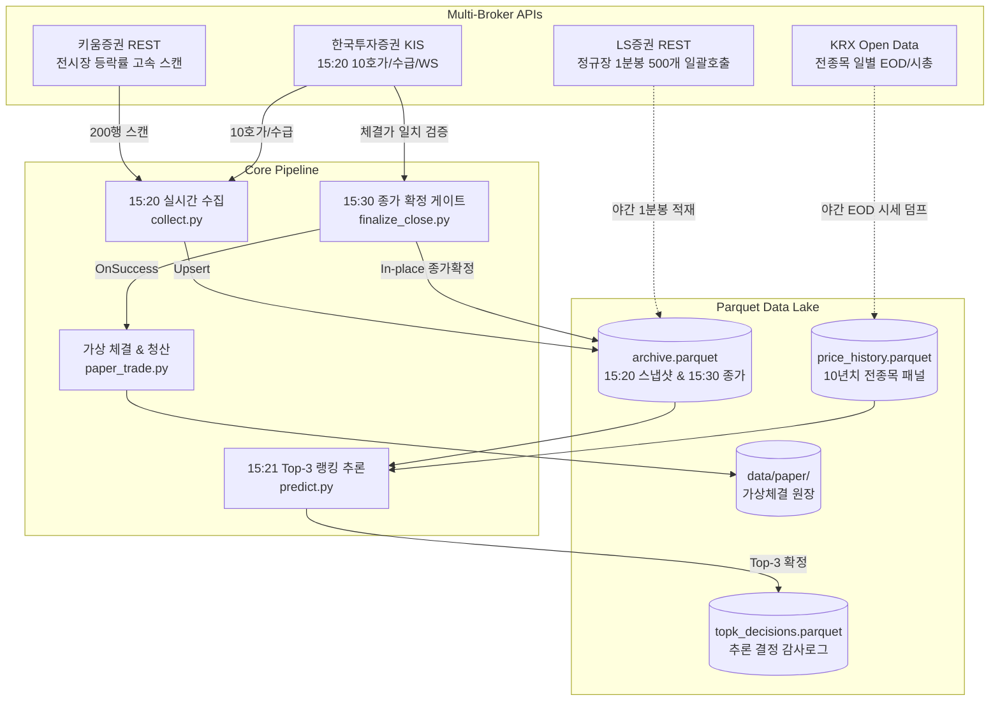

# System Architecture Overview

> **Target Audience:** 기술 면접관, 퀀트 시스템 엔지니어, 데이터 엔지니어  
> **Core Mission:** 장 마감 직전 10분(15:20~15:30) 동안 미래 정보 누출(Look-Ahead Bias) 없이 실시간 데이터를 수집하고, 비용 인식형 ML 리랭커로 익일 시초가(09:00) 청산 대상 Top-3 포트폴리오를 선정하는 오버나잇 퀀트 시스템.

---

## 1. System Goals

1. **Point-in-Time (PIT) 무결성**: 15:20 시점에 관측 불가능한 미래 데이터(당일 확정 종가, 익일 갭 등) 유입을 원천 차단.
2. **거래비용(Tick Friction) 통제**: 1틱 비용 12bp 초과 종목 및 상한가 제외, 법정거래세(18~23bp)와 왕복 2틱 스프레드를 전액 차감한 실질 순수익 기준 설계.
3. **멀티 브로커 처리량 최적화**: 4개 증권사 API의 Rate Limit과 응답 특성을 결합하여 15:20~15:30 병목 해소.

---

## 2. System Topology

---

## 3. Core Component Roles

| 컴포넌트 | 책임 | 실행 주기 | 주요 특징 |
| :--- | :--- | :--- | :--- |
| **Realtime Ingestion** | 15:20 후보군 스캔, 단면 수집, 12bp 틱비용 필터링 | 매일 15:20:00 | 15:20~15:30 창 외 실행 차단, 정상률 >= 99% 강제 |
| **Ranking & Inference** | 28개 PIT 피처 산출, 5-Seed LightGBM 앙상블 추론 | 매일 15:21:00 | 비용 적격 종목 중 Top-3 등가중 선정 (< 1.5초) |
| **Close Finalization** | 15:30 단일가 체결 3중 게이트 검증 및 종가 갱신 | 매일 15:30:30 | 불일치 시 EOD 갱신 거부, 최대 15:33까지 재시도 |
| **Paper Broker** | 실주문 없이 WebSocket 실시간 틱 기반 가상 체결 | 15:30 진입 / 09:00 청산 | 실전 슬리피지 및 체결 엔진 사전 리허설 |
| **Intraday & Bulk EOD** | 워치리스트 1분봉/틱 아카이빙 및 전종목 EOD 시세 적재 | 매일 20:05 / 21:00 | KRX 전종목 덤프 + KIS 30일 수급 결합 |

---

## 4. Multi-Broker Routing Allocation

단일 증권사 API의 초당 요청 한도(TPS 18)와 캔들 응답 용량 제약을 우회하기 위해 역할을 분산했습니다:

* **키움증권 (`ka10027`)**: 1회 호출당 200행 등락률 순위를 0.2초에 반환 $\rightarrow$ **15:20 전시장 후보군 고속 스캔**.
* **한국투자증권 (KIS)**: 10단계 호가잔량, 예상체결가(`antc_cnpr`), 장중 잠정수급을 동시 제공하는 유일 벤더 $\rightarrow$ **15:20 정밀 단면 캡처 & 15:30 종가 검증**.
* **LS증권 (`t8412`)**: 단일 호출로 390개 전체 1분봉 일괄 수신 $\rightarrow$ **야간 정규장 1분봉 아카이빙**.
* **토스증권 (`/api/v1/prices`)**: 1회 호출당 200종목 멀티 쿼트 지원 $\rightarrow$ **시세 쿼트 백업 및 캔들 폴백**.

*(※ 증권사별 상세 OpenAPI 규격은 [`docs/architecture/data/api_master.md`](data/api_master.md) 참조)*
