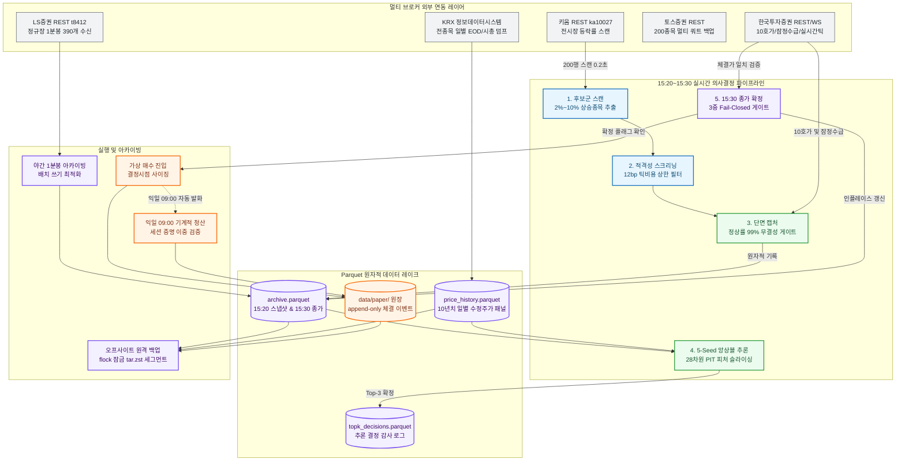

# System Architecture Design Specification

> **목표 독자:** CTO, 테크 리드, 퀀트 시스템 엔지니어  
> **핵심 사명:** 장 마감 직전 10분(15:20~15:30) 동안 미래 정보 누출(Look-Ahead Bias) 없이 실시간 데이터를 수집하고, 비용 인식형(Cost-Aware) 머신러닝 리랭커로 익일 시초가(09:00) 기계적 청산 대상 Top-3 포트폴리오를 선정하는 오버나잇 퀀트 트레이딩 시스템.

---

## 1. System Scope (시스템 범위 및 명시적 경계)

| 구분 | 명시적 포함 범위 (In-Scope) | 명시적 제외 범위 (Out-of-Scope) |
| :--- | :--- | :--- |
| **시간 도메인** | • 15:20:00 실시간 스냅샷 수집 및 15:21 랭킹 추론<br>• 15:30:30 단일가 종가 확정 및 익일 09:00:00 기계적 청산 | • 09:00~15:20 장중 실시간 스캘핑 및 데이트레이딩<br>• 익일 09:00 이후 장중 트레일링 스탑 및 동적 분할 익절 |
| **데이터 정합성** | • 15:20 단면 잠정 데이터와 15:30 확정 데이터의 완전 분리<br>• 2023-01-25 KRX 호가단위 개편 소급 및 법정세율 스케줄 | • 장마감 후 시간외 단일가(16:00~18:00) 임의 매매<br>• 사후 갭 필터 등 백테스트 환각을 유발하는 사후 편향 |
| **실행 및 주문** | • 실시간 체결틱(`H0STCNT0`) 기반 가상 체결 원장(Paper Ledger)<br>• 결정시점 가격 기반 자본 비중 할당 및 현금 한도 가드 | • 무인 실계좌 자동 발주 (실전 주문 이중 안전 확인 미충족 시 차단)<br>• 장중 미체결 잔량 취소 후 시장가 재주문 등 능동 주문 제어 |
| **운영 및 인프라**| • systemd 타이머 기반 24/7 상태머신 및 자율 복구<br>• 파일 잠금(flock) 직렬화 기반 원격 백업 및 보존 상한 | • 멀티 노드 분산 클러스터 (단일 호스트 경량화 원칙 준수)<br>• 수백억 원 이상 초고액 AUM 대상 시장 충격 비용 제어 |

---

## 2. Component Topology & Multi-Broker Interfaces

단일 증권사 API의 초당 요청 한도(TPS 18)와 캔들 응답 병목을 극복하기 위해 4대 증권사 OpenAPI를 역할별로 분산 라우팅합니다.



### 브로커 인터페이스 규격 및 트래픽 분산
* **키움증권 (`ka10027`)**: 1회 호출당 200행 등락률 순위를 **`0.2초`** 내 반환 $\to$ 15:20 전시장 상승 후보군 실시간 탐색.
* **한국투자증권 (KIS)**: 10단계 호가잔량, 예상체결가(`antc_cnpr`), 장중 잠정수급, 실시간 체결틱(`H0STCNT0`) 제공 $\to$ 의사결정 단면 수집 및 종가 체결 검증.
* **LS증권 (`t8412`)**: 1회 호출로 당일 정규장 390개 1분봉 일괄 수신 $\to$ 20:05 야간 인트라데이 아카이빙 (호출수 **`390배`** 절감).
* **토스증권 (`/api/v1/prices`)**: 1회 호출당 200종목 멀티 쿼트 지원 $\to$ KIS 장애 시 시세 폴백 백업.

---

## 3. 24/7 State Machine & Orchestration Lifecycle

시스템은 systemd 타이머 유닛 기반으로 자율 구동되며, 공통 세션 캘린더(`resolve_session_day`)로 비영업일 오발화를 원천 차단합니다.

| 시각 (KST) | 타이머 유닛 | 오케스트레이션 단계 | 핵심 안전장치 및 실패 처리 |
| :---: | :--- | :--- | :--- |
| **08:30** | `kca-kis-token-warmup` | **인증 사전 워밍업** | 브로커 API 슬롯별 격리 발급, 휴장일 자동 스킵, 멱등 갱신 |
| **09:00** | `kca-paper-exit` | **익일 기계적 청산** | 세션 캘린더 증명(당일 시세 일치 검증), 휴장일 유령 체결 0% 차단 |
| **15:20** | `kca-collect` | **15:20 단면 스냅샷** | 실행 시간창(15:20~15:30) 검증, 단면 수집 정상률 99% 미달 시 즉시 중단 |
| **15:21** | `kca-predict` | **Top-3 랭킹 추론** | 28차원 PIT 피처 산출, 결측치 플레이스홀더 금지 (미달 시 전액 현금) |
| **15:30** | `kca-finalize-close` | **장마감 종가 확정** | 3중 Fail-Closed 게이트 (시계 + 마감코드 '3' + 호가/체결가 일치) |
| **15:30** | `kca-paper-entry` | **가상 매수 진입** | `종가_확정=True` 확인 시 발화, 결정시점 사이징 및 현금 초과 방지 |
| **20:05** | `kca-archive-intraday`| **분봉/틱 야간 적재** | 세마포어 동시성 제어 및 배치 플러시 (쓰기 지연 207s $\to$ 0.53s) |
| **21:00** | `kca-price-ingest` | **EOD 시세 통합** | KRX 전종목 패널 통합, 기준/레버리지 포트폴리오 성과 귀속 계산 |
| **22:00** | `kca-backup` | **오프사이트 세그먼트**| 파일 잠금(flock) 직렬화, tar.zst 세그먼트 봉인 및 원격 MD5 검증 |
| **23:00** | `kca-daily-audit` | **일일 무결성 감사** | 분봉 완전성 감사, 백업 신선도 점검, 미전송 알림(outbox) 자동 회수 |

---

## 4. Data Models & Domain Financial Integrity Barriers

### 4.1. 15:20 vs 15:30 듀얼 타임스탬프 원장 스키마
금융 시계열의 사후 정보 편향(Look-Ahead Bias)을 근본 차단하기 위해 단일 행 내에서 의사결정 시점과 확정 시점의 가격을 격리합니다:
* **`decision_close`**: 15:20 의사결정 당시 관측된 장중 체결가 (수정 불가 영구 불변값).
* **`close`**: 15:30 장마감 단일가 경매를 거쳐 공식 확정된 EOD 최종 종가.
* **`종가_확정`**: 15:20 수집 시점 기본값 `False`, 15:30:30 게이트 통과 시 `True`로 원자적 갱신.

### 4.2. 5대 Fail-Closed 런타임 가드
1. **시계열 시간창 가드**: 경과시간 계측용 단조시각과 타임스탬프용 절대시각(UTC)을 결합하여 `15:20:00 <= now <= 15:30:00` 외 수집 실행 즉시 차단.
2. **세션 캘린더 단일 리졸버**: 하드코딩된 날짜 상수 배제, KIS 오라클 기반 휴장일/단축장(`CLOSED`/`HALF`) 명시적 감지 및 스킵.
3. **단면 수집 정상률 99% 게이트**: 호출 실패, 결측, 음수 가격 등 이상치 비율이 1.0%를 초과할 경우 전체 단면 저장 거부 (오염 데이터 적재 방지).
4. **3중 종가 확정 게이트**: ① KST 15:30:00 도달 확인, ② 단일가 마감 코드('3') 확인, ③ KIS 현재가 TR과 10호가 체결가 일치 확인. 3조건 동시 충족 시에만 종가 확정.
5. **원자적 스토리지 교체 (`atomic_write_parquet`)**: 임시 파일(`.tmp`)에 전체 직렬화 완료 후 OS `rename`으로 교체하여 프로세스 충돌 시 파일 손상 0건 보장.

---

## 5. Layered Architecture Contracts & Static Invariants

코드베이스는 단방향 의존성 규칙을 강제하는 5계층 아키텍처를 준수합니다.

```text
Layer 4: Production CLI & System Entrypoints (src/daily/, src/backfill/, src/tools/)
   │     - 실행 라이프사이클 트리거, CLI 파라미터 파싱, 환경 프로비저닝
   ▼
Layer 3: Serving & Automation Orchestrators (src/serving/, src/ml/retrain.py)
   │     - 실시간 피처 번들 서빙, 모델 레지스트리 재학습 파이프라인
   ▼
Layer 2: Quant Domain Engine & Research (src/strategy/, src/ml/, src/execution/)
   │     - 유니버스 계약, 5-Seed LGBM 앙상블, PIT 거래비용/호가단위 모델
   ▼
Layer 1: Data Access & Infrastructure Gateways (src/data/, src/api/, src/sync/, src/utils/)
   │     - Parquet 코덱, 4대 브로커 클라이언트, 커널 flock 파일 잠금
   ▼
Layer 0: Core Schemas, Types, and Configurations (src/config/, src/settings.py)
         - 시장 세션 상수, Pydantic 불변 설정 객체, 시스템 기본 경로
```

### 아키텍처 정적 불변식 규칙
* **단방향 하향 의존성**: 상위 계층은 하위 계층만 참조 가능하며, 하위 계층에서 상위 계층으로의 역방향 임포트는 정적 검사에서 즉시 차단됩니다.
* **비용 모델 단일 소유권**: 모든 법정세율 및 호가단위 틱비용 계산은 `src.execution.cost_model`을 유일한 원천으로 소비하며, 중복 정의를 금지합니다.
* **AST 기반 정적 위생**: 파이썬 AST 파싱을 통해 사용되지 않는 데드 코드(Dead Code) 및 미도달 분기 생성을 원천 방지합니다.
* **원장 동시성 보장**: `PaperLedger`는 커널 `flock` 기반 세션 락을 통해 동일 호스트 내 동시 다발적 진입/청산 경합을 직렬화합니다.
