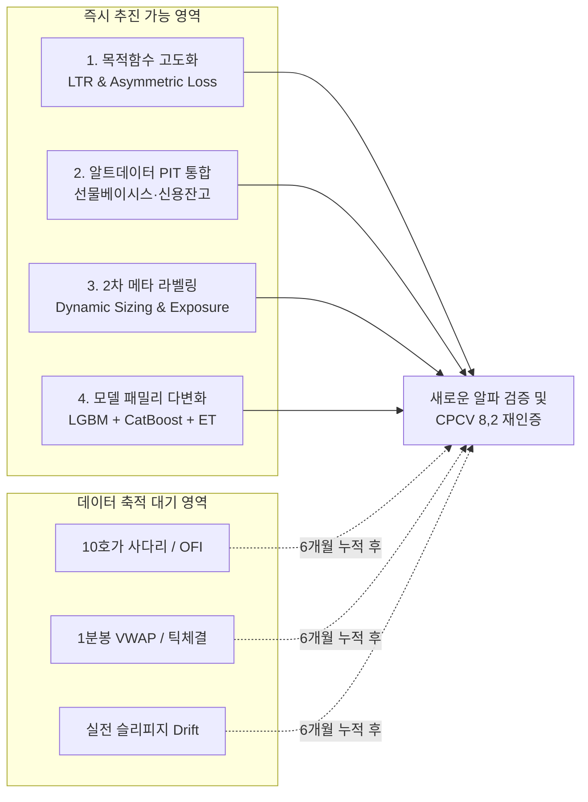

# 데이터 축적 대기 국면과 ML 전략 추가 개선 로드맵 고찰

> **문서 상태:** 활성 연구 및 전략 로드맵 (Active Research & Strategy Roadmap)  
> **기준 시점:** 2026-09-13  
> **관련 문서:** [`docs/research/closing_strategy_matrix.md`](file:///home/kth/k-closing-alpha/docs/research/closing_strategy_matrix.md), [`docs/architecture/design-decisions.md`](file:///home/kth/k-closing-alpha/docs/architecture/design-decisions.md)

---

## 1. 개요 및 핵심 질문 (Overview & Context)

### 1.1 현황 요약
* **전략 매트릭스 완비:** 118개 무누출 전략(Core 35 + Edge 32 + Granular 51)의 CPCV(8,2) 28개 무누출 경로 검증을 완료하고, 최종 **3대 챔피언 포트폴리오(공격형·밸런스형·극방어형)**를 도출함.
* **프로덕션 가동:** 15:20 수집 $\to$ 28차원 PIT 피처 생성 $\to$ 5-Seed LightGBM 앙상블 추론 $\to$ 15:30 종가 확정 게이트 $\to$ 익일 09:00 시초가 기계적 청산 파이프라인 및 섀도 원장 가동.
* **VPS 자동 데이터 수집 로직 구비:** 15:20 시점 10호가 사다리/예상체결(`orderbook`), 정규장/NXT 프리·애프터 1분봉 및 실시간 체결틱(`intraday`), 대안 데이터(`altdata`)가 매일 VPS에서 자동 아카이브되기 시작함.

### 1.2 핵심 질문
> **"이제는 데이터 수집을 기다려야 하는 때일까? 아니면 ML 전략의 추가 개선이 가능할까?"**

**핵심 결론:**  
**"데이터 축적을 기다려야 하는 영역"**과 **"기존 데이터로 즉시 추진 가능한 개선 영역"**을 분리하는 **2-Track 병행 전략**이 유일한 해법이다. VPS의 마이크로스트럭처(호가/틱) 데이터는 충분한 표본 기간(최소 6개월~1년) 누적 전까지 학습 투입을 유예하되, 기보유 10년치 일별 패널 및 알트데이터 기반으로 즉시 추진 가능한 고부가가치 ML 고도화 과제들이 존재한다.

---

## 2. 데이터 축적을 기다려야 하는 영역 (Wait & Accumulate)

VPS에서 신규 수집 중인 초단기 미시구조(Microstructure) 데이터는 **과거 10년 치로 소급(Backfill)할 수 없는 특성**을 지닌다.

| 대상 데이터 | 저장 경로 | 수집 주기 | 필수 축적 요구 기간 | 조기 투입 시 치명적 리스크 |
| :--- | :--- | :---: | :---: | :--- |
| **15:20 10호가 사다리 & 예상체결** | `data/history/orderbook/` | 매일 15:20 단면 | **최소 120~250 거래일**<br>(6개월~1년) | 수일~수주 단기 표본 학습 시 당해 장세 노이즈에 피팅되어 CPCV OOF 일반화 성능 붕괴 |
| **정규장·NXT 1분봉 및 틱 체결** | `data/history/intraday/` | 야간 아카이브 | **최소 120 거래일 이상** | 15:00~15:20 단기 체결강도/VWAP 이격 등은 계절성·시장 변동성 국면별 편차가 극심함 |
| **실전 슬리피지 Drift 관측** | 섀도 페이퍼 원장 | 일일 실시간 | **최소 60~120 거래일** | 상승장/급락장/횡보장을 고루 거치지 않고는 틱 스프레드 및 체결 지연 실측 신뢰도 미달 |

### 왜 지금 당장 호가·틱 데이터를 학습에 넣으면 안 되는가?
1. **표본 수 부족에 따른 과적합 (Degrees of Freedom Problem):**  
   현재 호가 스냅샷은 2026년 9월부터 적재되어 약 수 거래일 분량에 불과하다. 28개 무누출 경로를 지닌 CPCV(8,2) 평가 구조에서, 블록별 데이터 수가 부족하면 통계적 검정력(t-stat)이 소멸한다.
2. **시장 국면 편향 (Regime Bias):**  
   단기 수집 구간 동안의 특정 테마 장세나 지수 변동성이 피처 중요도(Feature Importance)를 왜곡하여 장기 안정성을 해친다.

### 현 시점의 올바른 엔지니어링 액션
* **학습 유예, 파이프라인 선제 구축:**  
  모델 학습은 중단하되, 데이터가 쌓였을 때 즉시 피처로 변환할 수 있는 **"호가 불균형(OFI) 계산 모듈"** 및 **"종가 10분 전 체결강도/VWAP 이격도 변환 모듈"**을 미리 개발하고 단위 테스트(`tests/`)를 완료해 둔다.

---

## 3. 기존 데이터로 즉시 추진 가능한 ML 전략 개선 (Immediate Enhancements)

프로젝트에 이미 적재되어 있는 10년 치 전종목 일별 패널([`price_history.parquet`](file:///home/kth/k-closing-alpha/data/history/price_history.parquet))과 대안 데이터 레이크([`altdata/`](file:///home/kth/k-closing-alpha/data/history/altdata))를 기반으로 지금 즉시 연구·개선할 수 있는 4대 과제이다.



### 3.1 손실 함수(Loss Function) 및 목적함수 고도화
* **Learning-to-Rank (LambdaMART / Pairwise Loss) 전환:**
  * **근거:** 현재 모델은 수익률 절대치를 맞히는 회귀(`date_demeaned` L1/L2) 방식이다. 그러나 종가매매의 본질은 "수익률 예측"이 아니라 **"당일 10개 내외 후보군 중 가장 높은 상승 탄력을 보일 상위 1~3위를 가려내는 것(Ranking)"**이다.
  * **실행:** LightGBM의 `lambdarank` 목적함수 및 NDCG 랭킹 손실을 적용하여 횡단면 상대 우위 변별력을 극대화한다.
* **비대칭 하방 페널티 손실 (Asymmetric Downside Loss):**
  * **근거:** 상방 오차(+30bp를 +50bp로 예측)보다 하방 오차(-200bp 갭하락을 +50bp로 예측)가 계좌 MDD에 치명적이다.
  * **실행:** 예측값보다 실제값이 낮을 때 손실 페널티를 2~3배 가중하는 비대칭 Huber/MSE 커스텀 목적함수를 적용하여 테일 리스크를 사전 차단한다.

### 3.2 기보유 대안 데이터(`data/history/altdata/`)의 PIT 피처 결합
이미 아카이브되어 있는 대안 데이터들을 15:20 시점 무누출(Point-in-Time) 제약에 맞춰 피처 엔지니어링에 편입한다.

1. **`derivatives_basis.parquet` (선물 베이시스 레짐):**
   * 당일 선물 시장의 콘탱고/백워데이션 강도는 익일 장초반 기관 프로그램 매물 출회 여부와 직결됨.
   * `f_basis_zscore` (5일 롤링 베이시스 Z-Score) 신규 피처 도입.
2. **`credit_balance.parquet` (신용잔고 과열도):**
   * 종목별 신용융자 잔고 급증 종목은 익일 시초가 차익 실현 및 반대매매 위험 노출.
   * `f_credit_chg5` (5일 신용융자 잔고 증감률) 도입.
3. **`program_trade_daily.parquet` (프로그램 순매수 밀도):**
   * 매트릭스 `DIM4-01` 실증에서 확인된 프로그램 수급을 일별 누적 추세 지표(`f_pgm_cum5`)로 확장.
4. **`shorting.parquet` (공매도 잔고/거래 비중):**
   * 숏스퀴즈 가능 종목 및 공매도 집중 종목의 갭 리스크 차별화.

### 3.3 2단계 메타 라벨링(Meta-Labeling) 기반 동적 포지션 사이징
* **근거:** 매트릭스 `UNEXP-I05`(Dynamic K: 확신도 스프레드 $\ge$ 15bp 시 K=1, 외 K=3)는 Sharpe 2.59, Net +36.47bp를 기록했다.
* **개선안:**
  1. **Primary Model (기존 랭커):** 당일 후보군 중 Top-1~3 종목 및 예상 기대수익률 추출.
  2. **Secondary Model (메타 분류기):** 선정된 1위 종목이 **"마찰비용(왕복 2틱+세금)을 차감하고도 실제로 이익을 낼 확률($P_{win}$)"**을 0~1 사이로 예측.
  3. **Bet Sizing:**
     * $P_{win} \ge 0.65$: 확신 구간 $\to$ K=1 집중 투자 (100% 익스포저).
     * $0.50 \le P_{win} < 0.65$: 표준 구간 $\to$ K=3 분산 투자.
     * $P_{win} < 0.50$: 불확실 구간 $\to$ 전액 현금 보유(Pass)로 손실 회피.

### 3.4 트리 모델 다변화 (CatBoost & ExtraTrees 스태킹)
* 단일 LightGBM 구조에서 벗어나 범주형 변수(업종, 시장구분) 처리에 강건한 CatBoost 및 극단적 무작위성을 부여한 ExtraTrees(`DIM1-03` Net +17.98bp)를 결합하는 다중 패밀리 앙상블 구성.

---

## 4. 실행 로드맵 (Actionable 4-Track Roadmap)

```text
[Track A: 알트데이터 결합] ────► 28차원 -> 32차원 피처 확장 ────► CPCV(8,2) 재인증
[Track B: 목적함수 개선]   ────► LTR / Asymmetric Loss 실험  ────► Top-3 적중률 검증
[Track C: 호가/틱 사전준비] ────► OFI/VWAP 피처 추출기 개발   ────► (데이터 축적 대기)
[Track D: 섀도 원장 모니터링] ──► 3대 챔피언 실체결 오차 관측   ────► 슬리피지 Drift 점검
```

| 트랙 (Track) | 핵심 과업 | 데이터 의존성 | 기대 산출물 및 검증 기준 |
| :--- | :--- | :---: | :--- |
| **Track A (즉시 실행)** | **알트데이터(`altdata/`) PIT 결합**<br>- 선물 베이시스 롤링 레짐<br>- 신용잔고 5일 증감률<br>- 프로그램 누적 수급 | 기존 패널 완비 | • 피처 매니페스트 확장 (28 $\to$ 32~34개)<br>• CPCV(8,2) 28개 경로 무패 유지 여부 확인 |
| **Track B (즉시 실행)** | **손실함수 & 메타 사이징 실험**<br>- LightGBM LambdaRank 목적함수<br>- 하방 비대칭 페널티 Huber Loss<br>- 2단계 메타 라벨링 동적 사이징 | 기존 패널 완비 | • Base Top-3 대비 MDD 추가 2~3%p 축소<br>• Sharpe $\ge$ 3.0 도달 여부 평가 |
| **Track C (사전 구축)** | **마이크로스트럭처 파이프라인 개발**<br>- 10호가 사다리 잔량 불균형(OFI)<br>- 장마감 20분 VWAP 이격도 | 수집 중인 데이터 | • `src/data/microstructure.py` 코덱 작성<br>• 단위 테스트 100% 통과 후 보관 |
| **Track D (운영 유지)** | **VPS 수집 안정성 & 섀도 원장 추적**<br>- KCA 수집 데몬 헬스체크<br>- 3대 챔피언 섀도 원장 체결 대조 | 실시간 운영 | • 일일 단면 수집률 $\ge 99.0\%$ 유지<br>• 실전 틱비용 슬리피지 허용범위(12bp) 점검 |

---

## 5. 결론 및 실천적 제언

1. **VPS 데이터 수집을 "기다리기만" 할 필요는 전혀 없다.**  
   호가창과 체결틱은 최소 6개월 이상 안정적으로 쌓이도록 시스템 데몬에 맡겨두면 된다.
2. **지금 당장의 엔지니어링 집중점은 "알트데이터 PIT 통합"과 "목적함수 고도화(LTR / 비대칭 손실)"이다.**  
   기존 10년 일별 패널을 통해 이미 완전 무결한 검증 환경(CPCV 8,2)이 갖추어져 있으므로, 이 기반 위에서 피처 및 손실함수 개선을 진행하는 것이 시간과 자원을 가장 극대화하는 퀀트 엔지니어링 경로이다.
