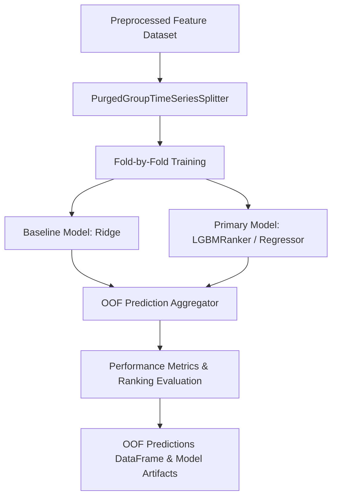

# Model Pipeline Specification: ML Model Training & Purged Walk-Forward Evaluation

## 1. Overview & Goal
- **Goal**: 데이터 전처리 및 피처 엔지니어링이 완료된 후보군 데이터셋을 바탕으로, 시계열 데이터 누수 없이 **Purged Walk-Forward Cross Validation** 방식으로 ML 모델(Baseline: Ridge, Main: LGBMRanker / LGBMRegressor)을 학습시키고 OOF(Out-of-Fold) 예측 결과 및 평가 지표(NDCG@1, NDCG@3, Rank IC, Top-k Net Return)를 도출하는 파이프라인 구축.
- **Scope**:
  - `src/ml/purged_cv.py`: Group(날짜) 단위 Purged Time-Series Walk-Forward Splitter
  - `src/ml/model_pipeline.py`: 모델 학습, OOF 예측 산출 및 백테스트 평가 지표 계산
  - `tests/unit/ml/test_purged_cv.py` & `tests/unit/ml/test_model_pipeline.py`: 단위 테스트 코드

---

## 2. Plan.md Review & Technical Feedback

### 2.1 Multi-Model (Ranker + Quantile + Classifier) 동시 구축의 과도한 복잡성
- **문제점**: `plan.md`에서 제시한 Ranker + Quantile + Classifier + Calibration 4개 모델 동시 조합은 초기 모델 검증 단계에서 오버헤드와 과적합 위험을 크게 가중시킵니다.
- **개선안**: 1차 스텝에서는 **Purged Walk-Forward CV 기반 단일 LGBMRanker / LGBMRegressor 파이프라인**으로 파이프라인의 시계열 정합성과 Baseline 대비 수수료 차감 후 Top-k Uplift를 명확히 검증합니다. 이후 Quantile/Calibration은 모듈형 플러그인으로 용이하게 결합하도록 설계합니다.

### 2.2 고정 Relevance Labeling(0~4 등급)의 횡단면 바운더리 왜곡
- **문제점**: 일자별 후보 수가 상이한 환경(예: 2개 포착일 vs 15개 포착일)에서 0~4 등급 하드코딩 분할 시 바운더리가 왜곡됩니다.
- **개선안**: 날짜별 `Net Return`을 Cross-sectional Rank Percentile (`0~4` 간격의 float/int relevance) 또는 Z-score로 동적 계산하여 `LGBMRanker` group relevance로 전달합니다.

---

## 3. Machine Learning Pipeline Architecture



### 3.1 Purged Group Walk-Forward Splitter (`src/ml/purged_cv.py`)
- **Key Invariant**: 동일 날짜(`date` group)의 모든 후보 종목은 같은 fold에 속해야 하며, Train과 Validation 경계에 위치한 샘플은 보유기간 \(H\) (Purge Gap) 만큼 제외(purge)되어 미래 데이터 누수를 완전히 차단합니다.

### 3.2 Model Selection & Pipeline (`src/ml/model_pipeline.py`)
- **Baseline**: `sklearn.linear_model.Ridge` (선형 랭킹/회귀 기준선)
- **Primary**: `lightgbm.LGBMRanker` (`objective='lambdarank'`, `group=date_counts`) 및 `lightgbm.LGBMRegressor` (`objective='huber'`)
- **Evaluation Metrics**:
  - `NDCG@1`, `NDCG@3` (랭킹 품질)
  - `Rank IC` (Spearman Rank Correlation)
  - `Top-1 Return`, `Top-3 Return` (수수료 차감 후 실제 순수익률)

---

## 4. Contract Details & Public Interfaces

### 4.1 `PurgedGroupTimeSeriesSplit` Signature
```python
class PurgedGroupTimeSeriesSplit:
    def __init__(self, n_splits: int = 5, purge_gap: int = 1) -> None: ...
    def split(self, X: pd.DataFrame, y: pd.Series | None = None, groups: pd.Series | None = None) -> Generator[tuple[np.ndarray, np.ndarray], None, None]: ...
```

### 4.2 `run_model_pipeline` Signature
```python
def run_model_pipeline(
    df: pd.DataFrame,
    feature_cols: list[str],
    target_col: str,
    group_col: str,
    n_splits: int = 5,
    purge_gap: int = 1,
    model_type: str = "lgb_ranker",
) -> dict[str, Any]:
    """Train ML model using Purged Group Walk-Forward CV and evaluate OOF results.
    
    Returns:
        dict containing 'oof_df', 'metrics', and 'trained_models'.
    """
```

---

## 5. Risk & Verification Strategy
- **Data Leakage Risk**: Purging 경계 검증 함수를 단위 테스트(`tests/unit/ml/test_purged_cv.py`)로 확인하여 Train end date와 Val start date 사이 간격이 최소 `purge_gap` 이상 유지되는지 자동 검증.
- **Verification Loop**: `uv run pytest tests/unit/ml/` 및 `uv run python tools/agent_skills/lean_check.py --spec-only --spec docs/specs/model_pipeline_contract.json` 통과.
